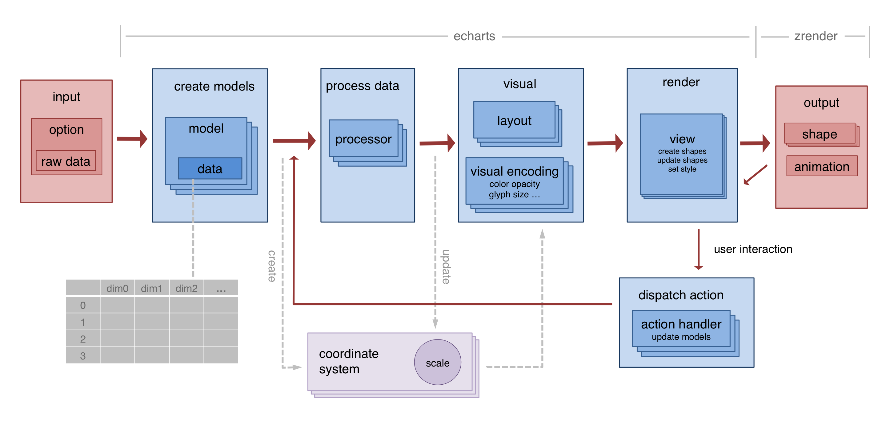

### Animation


---

#### just effects

{0|example: hover, select, ...}

<div style="min-width: 1050px; text-align: center;">
<div style="display:inline-block;">
{1|~[450*400](./asset/ec-demo/ani-effect-hover.html)}
</div>
<div style="display:inline-block;">
{2|~[450*400](./asset/ec-demo/ani-effect-hover.html?animation=false)}
</div>
</div>

----

#### functional effects

{0|example: opening animation}

{1|~[1200*500](./asset/ec-demo/ani-effect-delay.html)}

----

#### functional effects

{0|example: stream}

{1|~[800*500](./asset/ec-demo/fn-effect-lines.html)}


----

#### for transform

<div style="min-width: 1050px; text-align: center;">
<div style="display:inline-block;">
{0|~[450*400](./asset/ec-demo/transform-timeline.html)}
</div>
<div style="display:inline-block;">
{1|~[450*400](./asset/ec-demo/transform-timeline.html?animation=false)}
</div>
</div>

----

#### for transform

{0|example: layout}

<div style="min-width: 1050px; text-align: center;">
<div style="display:inline-block;">
{0|~[450*400](./asset/ec-demo/transform-graph.html)}
</div>
<div style="display:inline-block;">
{1|~[450*400](./asset/ec-demo/transform-graph.html?animation=false)}
</div>
</div>


----

#### for transform

{0|example: data zoom}

<div style="min-width: 1050px; text-align: center;">
<div style="display:inline-block;">
{1|~[450*400](./asset/ec-demo/transform-data-zoom.html)}
</div>
<div style="display:inline-block;">
{2|~[450*400](./asset/ec-demo/transform-data-zoom.html?animation=false)}
</div>
</div>

----

#### for transform

{0|example: roam}

<div style="min-width: 1050px; text-align: center;">
<div style="display:inline-block;">
{1|~[450*400](./asset/ec-demo/transform-focus-geo.html)}
</div>
<div style="display:inline-block;">
{2|~[450*400](./asset/ec-demo/transform-focus-geo.html?animation=false)}
</div>
</div>

---

Animation Requirements

+ Reduce complexity of programming.
    + robustness
    + development efficiency
+ Performance.

----

Animation Module

+ main loop, requestAnimationFrame
+ frame, interpolation, easing

----

Programming Requirements

+ {0|Best practice => pattern}
+ {1|Pattern should be simple}

----

~[900*200](./asset/ec-demo/data-zoom2.html)

{0|}

Note:
Creating shape each time is an easy way.
But, animation requires shape reuse.

----

Programming Pattern: Data Diff

```js

// diff: map by key.
data.diff(oldData)
    .add(function (newIdx) {
        // Create symbol
        ...
        // Store symbol on data.
        data.setItemGraphicEl(newIdx, symbolEl);
    })
    .update(function (newIdx, oldIdx) {
        // Create or update symbol.
        ...
        // Store symbol on data.
        data.setItemGraphicEl(newIdx, symbolEl);
    })
    .remove(function (oldIdx) {
        // Remove symbol.
    })
    .execute();
```

----

```js
option = {
    animation: true,
    animationDuration: ...,
    animationEasing: ...,
    animationDelay: ...,
    ...,

    xxxx: [{
        animation: true,
        animationDuration: ...,
        animationEasing: ...,
        animationDelay: ...,
        ...
    }, {
        ...
    }]
};
```

----

```js
itemStyle: {
    normal: {
        color: ...,
        ...
    },
    emphasis: {
        color: ...,
        ...
    }
}
```

----

Programming Pattern: Unified API

```js
graphic.updateProps(symbolEl, {
    // properties to be updated with or without animation.
    position: point,
    ...
}, seriesModel);
```

----

Throttle

```js
fn = echarts.throttle(fn);
```


