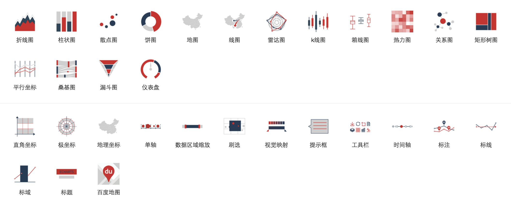
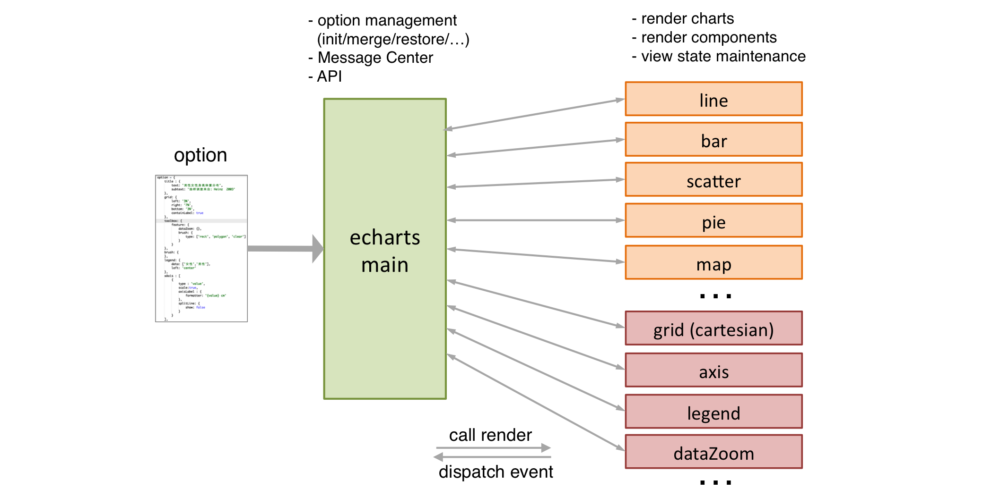

# echarts 结构和演进

百度前端技术部 echarts 团队


---


#### echarts

+ 浏览器端数据可视化图表组件库

+ <https://github.com/ecomfe/echarts>

+ <http://gallery.echartsjs.com>

+ 15000


---

### 纲要

+ 结构概览
+ 基本设定
+ 数据结构的抽象
+ 组件间的依赖和交互
+ 工作流程
+ 视觉编码
+ 反思


---

### Level 0


----

### zrender 层

+ {0|渲染引擎隔离（canvas (in browser/nodejs) / vml / svg / ...）}
+ {1|对象抽象 & 状态维护（Element / Group / Layer / ...）}
+ {2|用户交互封装（mouse event / touch / gesture / drag / ...）}
+ {3|动画（frame / easing / ...）}
+ {4|图形支持（transformable / contain / curve / ...）}
+ {5|其他基本工具（eventful / color / array diff / svg path converter / ...）}


----

### echarts 层

{0|图表 / 组件 / 交互行为 / API}

{0|}

> + {1|变化多、需扩展、需易维护}
> + {2|架构、演变}


---

#### 声明式接口

> {0|
    所有数据、组件、布局、行为、... <br>
    由用户声明的 **option** 描述 <br>
}

Note:
在基本设定（声明式，数据驱动，单向流）下才有后面的讨论。

----

~[1200*600](./asset/ec-demo/scatter-weight.html)

----

### 数据流 — Level 0


----

#### echarts 2.x Arch

{0|}

+ {1|flat and intuitive => easy to understand and learn}
+ {2|interaction, othogonality, extensibility => inadequate}


----

下面在这几方面介绍架构的设计和进化

+ {0|数据结构的抽象}
+ {1|工作流程}
+ {2|视觉编码}


---

## 数据结构的抽象

Note:
下面的介绍，按『需求』->『解决』（按需抽象）的逻辑

----

### 需求: 正交（1）

<div style="min-width: 1050px">
<div style="float:left;">
{0|
scatter on cartesian
~[350*400](./asset/ec-demo/orthogonal1-scatter-cartesian.html)
}
</div>

<div style="float:left;">
{1|
scatter on polar
~[350*400](./asset/ec-demo/orthogonal1-scatter-polar.html)
}
</div>

<div style="float:left;">
{2|
scatter on geo
~[350*400](./asset/ec-demo/orthogonal1-scatter-geo.html)
}
</div>

----

### 需求: 正交（2）

<div style="min-width: 1050px">
<div style="float:left;">
{0|
line on cartesian
~[350*400](./asset/ec-demo/orthogonal2-cartesian-line.html)
}
</div>

<div style="float:left;">
{1|
boxplot on cartesian
~[350*400](./asset/ec-demo/orthogonal2-cartesian-boxplot.html)
}
</div>

<div style="float:left;">
{2|
graph on cartesian
~[350*400](./asset/ec-demo/orthogonal2-cartesian-graph.html)
}
</div>

----

### 需求: 混合排布

{1|~[800*500](./asset/ec-demo/grid-on-geo.html)}

----

### 抽象

+ {0|**coordinate system** : cartesian / polar / geo / single / parallel ...}
+ {0|**chart** : line / bar / scatter / pie / candlestick ...}

Note:
coord 有公用的 interface（如 dataToPoint）。coord 有单独的阶段。

----

### 需求: 一个功能的多种用户交互形式

{0|~[800*400](./asset/ec-demo/interaction-multi-one.html)}

+ {1|Generalization: <br> dataZoom => insideZoom / sliderZoom / toolboxZoom}

----

### 需求: 统一的位置、尺寸描述方式

+ {0|六元：left / right / top / bottom / width / height}
+ {1|绝对值 / 百分比 / 'center'}

----

### 需求: 逻辑的复用（以 axis / scale 为例）

<div style="min-width: 1060px;">
<div style="float:left;">
{0|
axes in radar
~[350*400](./asset/ec-demo/reuse-axis-radar.html)
}
</div>
<div style="float:left;">
{1|
axes in parallel
~[350*400](./asset/ec-demo/reuse-axis-parallel.html)
}
</div>
<div style="float:left;">
{2|
axis in timeline
~[350*400](./asset/ec-demo/reuse-axis-timeline.html)
}
</div>
</div>


----

### 需求: 逻辑的复用（以 axis / scale 为例）

<div style="min-width: 1050px; text-align: center;">
<div style="display:inline-block;">
{0|
different shapes and angles
~[450*400](./asset/ec-demo/different-axis-position.html)
}
</div>
<div style="display:inline-block;">
{1|
different scales
~[450*400](./asset/ec-demo/different-axis-scale.html)
}
</div>
</div>


----

### 抽象

+ {0|**axis** : model / view}
+ {1|**scale** : interval / ordinal / time / log / ...}


----

### 需求: 逻辑的复用（以 data 为例）

<div>
{0|~[1100*500](./asset/ec-demo/list-sample1.html)}
</div>
{1|dataZoom 组件如何处理不同的图表中不同格式的数据？<br>（<del>if-else</del>）}


----

### 抽象

+ {0|**List** : line / bar / scatter / pie / parallel / candlestick / ...}
+ {0|**Graph** : force / chord / sankey / ...}
+ {0|**Tree** : treemap / tree / ...}


----

### 各种数据结构的抽象

+ Coordinate System
+ Scale
+ Axis
+ List / Graph / Tree
+ Symbol
+ RoamController
+ ComponentModel
+ ...


----

### Model & View

+ {0|option cascade}
+ {1|state maintenance}
+ {2|transition animation (view reuse)}
+ {3|option management (reset, timeline, responsive)}

Note:
过渡动画指的是：option 不放在 view 里管理，从而 view 能重用，从而能在非 merge 模式有过渡动画。
引入Model后这些feature的实现会清晰。

----


option cascade

----

~[1200*500](./asset/ec-demo/timeline.html)

option management: timeline

----

~[1200*500](./asset/ec-demo/media-query.html)

option management: responsive (media query)


---

## 组件间的依赖和交互

----


回顾: echarts2 ARCH

Note:
下面从『组件依赖』这个例子来介绍引入『工作流程』的意义。

----

【组件间的依赖】

<div>
{0|~[1100*300](./asset/ec-demo/workflow-basic.html)}
</div><div style="margin-top:-320px">
{1|~[1100*300](./asset/ec-demo/workflow-basic-mask.html)}
</div>

{2|依赖声明和拓扑}
{3|}

Note:
dependency: ec2#echarts.js: dataZoom.syncOption。

----

【组件间的交互】

<div>
{0|~[1100*300](./asset/ec-demo/workflow-basic.html)}
</div><div style="margin-top:-320px">
{1|~[1100*300](./asset/ec-demo/workflow-basic-mask2.html)}
</div>

+ {1|行为：过滤数据、显示 / 隐藏、改变范围、...}
+ {2|<del>一个组件间直接调用另一个组件</del>}

----

【组件间的交互】

echarts2：事件通讯


{0|消除了组件的『实例间的依赖』}

----

问题 1：需主动监听其他组件的事件。

{0|~[1100*220](./asset/ec-demo/workflow-basic.html)}

{1|}

{2|组件之间仍然要互相知晓（类型的依赖）}

Note:

onlegendselected 中，tooltip 要主动监听，并更新自己的 selectedMap，从而才能遍历 series 时候避开没有选中的。各个 component 都要主动监听，则扩展性问题。

----

问题 2：

```javascript
// 因为交互行为导致的后续过程（如清除、刷新等）可能有所不同，
// echarts main 只得主动监听一些组件事件，从而形成了 switch case。
switch (eventType) {
    case ecConfig.EVENT.LEGEND_SELECTED :
        this._onlegendSelected(param);
        break;
    case ecConfig.EVENT.DATA_ZOOM :
        ...
        this._ondataZoom(param);
        break;
    case ecConfig.EVENT.DATA_RANGE :
        fromMyself && this._ondataRange(param);
        break;
    case ecConfig.EVENT.MAGIC_TYPE_CHANGED :
        ...
        this._onmagicTypeChanged(param);
        break;
    case ecConfig.EVENT.DATA_VIEW_CHANGED :
        fromMyself && this._ondataViewChanged(param);
        break;
    case ecConfig.EVENT.TOOLTIP_HOVER :
        fromMyself && this._tooltipHover(param);
        break;
    case ecConfig.EVENT.RESTORE :
    case ecConfig.EVENT.REFRESH :
    case ecConfig.EVENT.TOOLTIP_IN_GRID :
    case ecConfig.EVENT.TOOLTIP_OUT_GRID :
    ...
```

{1|纯粹的『事件模式』并不足以指导后续行为}


Note:

一些后续行为，如 clearEffect 之类，是公用的，不适于写在每个组件的事件响应函数中。


---

## echarts 工作流程

----

{0|}

+ {1|用户行为触发 => 组件改变各自状态 => 处理数据 => 更新视图}
+ {2|公共操作对象的归纳和抽离：**数据**}

{2|}


Note:
无非都是（1）改变状态（2）更新数据（3）刷新视图 和具体事件无关（刷新的类型稍微有点变化，比如tooltip不需要全局刷新）。
所以可以进一步解耦抽象：阶段。

----

+ {0|对数据的处理规则：**阶段** & 注册}

{0|}

----


echarts3 workflow


---

## 视觉编码

Note:

从视觉编码这例子来看工作流程。

----

#### 概念

+ 数据 => 视觉元素
+ {0|标记：点、线、面}
+ {1|视觉通道}

    + {1|颜色}
        {1|亮度、饱和度、透明度、色调}
    + {1|尺寸}
    + {1|形状}
    + {1|纹理}
    + {1|方向}
    + {1|动画}

----

~[1100*500](./asset/ec-demo/visualmap-sample1.html)

----

~[1100*550](./asset/ec-demo/visualmap-sample2.html)

----

~[800*500](./asset/ec-demo/mix-sample1.html)

----


----


Note:
不同组件都能干涉 visual（visaulMap 组件，brush 组件，原生组件）
（legend 对颜色的干涉 ec2 中存在 legend）


---


# ?

{0|尽量解耦？}
{1|尽量抽象？}

<br>

+ {2|工程妥协（优化、开发效率）}
+ {3|过度设计}

----

+ {0|上层架构和约定应考究}
+ {1|细节从权}


---

## The End


