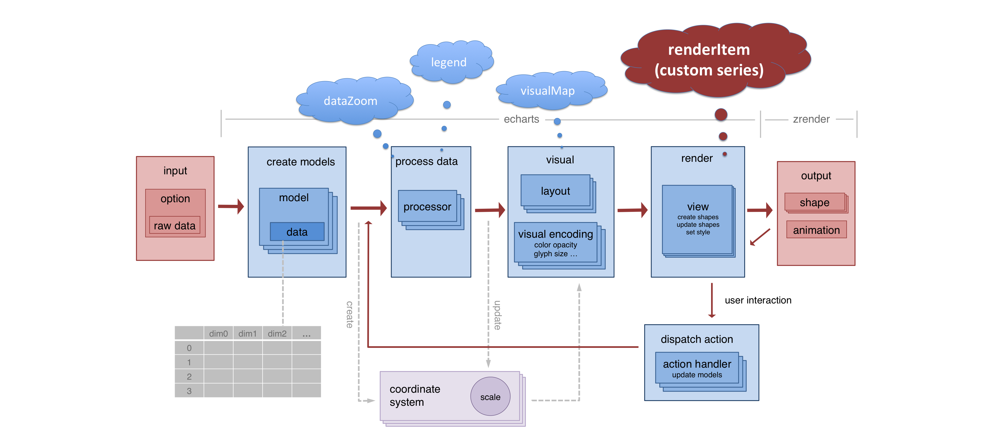
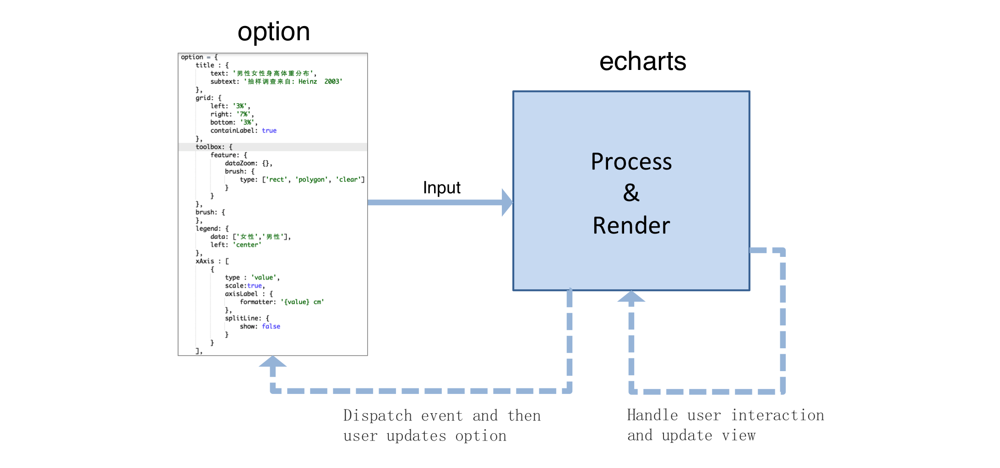

## 从简单图表到个性定制

宿爽

---

## echarts

+ 开源前端可视化库
    + <https://github.com/ecomfe/echarts> (star: 18k+)
    + 丰富的可视化类型和交互方式
    + 大数据量展现的能力
    + 动画和特效

---

最常见的图表

{0_1:code|~[1200*600](./asset/ec-demo/chart-simple1.html)}

----

~[1200*600](./asset/ec-demo/chart-simple2.html)

Note:
看看这个 option 中有哪些东西。

----

然而，稍复杂些的图表，可能是这样的：

{0|~[1200*550](./asset/ec-demo/brush-map.html)}

----

~[1200*550](./asset/ec-demo/grid-on-geo.html)

----

~[1200*550](./asset/ec-demo/link-brush1.html)

----

多种形式的 **组合** 和 **交互**

---

### 坐标系和系列（series）

----

~[1200*550](./asset/ec-demo/chart-simple3.html)

----

坐标系和系列的组合

{0|
line on cartesian
~[350*400](./asset/ec-demo/orthogonal2-cartesian-line.html)
}

{1|
boxplot on cartesian
~[350*400](./asset/ec-demo/orthogonal2-cartesian-boxplot.html)
}

{2|
graph on cartesian
~[350*400](./asset/ec-demo/orthogonal2-cartesian-graph.html)
}

----

一个图中的多个坐标系

{0|~[1200*550](./asset/ec-demo/chart-simple4.html)}

----

各种坐标系

{0|

直角坐标系 cartesian2d

~[350*400](./asset/ec-demo/orthogonal1-scatter-cartesian.html)
}

{1|

极坐标系 polar

~[350*400](./asset/ec-demo/orthogonal1-scatter-polar.html)
}

{2|

地理坐标系 geo

~[350*400](./asset/ec-demo/orthogonal1-scatter-geo.html)
}

----

各种坐标系（2）

{0|

平行坐标系 parallel

~[350*400](./asset/ec-demo/orthogonal1-scatter-parallel.html)
}

{1|

单轴坐标系 singleAxis

~[350*400](./asset/ec-demo/orthogonal1-scatter-singleAxis.html)
}

{2|

日历坐标系 calendar

~[350*400](./asset/ec-demo/orthogonal1-scatter-calendar.html)
}

---

### 系列的自定义

----

内置支持的许多图表和组件

+ {0|只能枚举常用图表，需求无法穷尽}
+ {1|没有来得及/没有计划 内置支持的图表类型}

----

例如 如何实现：

{0_1:code|~[1200*450](./asset/ec-demo/pictorialBar-dotted.html)}

{2|组合使用多个系列做出效果}

----

另一个信息图例子

{0_1:code|~[1200*500](./asset/ec-demo/pictorialBar-velocity.html)}

{2|使用单独系列做图标、文字等}

----

刚才的例子都基于现在已支持的 series type
{0|现有的 series type 不满足需求怎么办？}

----

OHLC 图

{0_1:code|~[1200*500](./asset/ec-demo/ohlc.html)}

----

这种扩展方式的方便之处

{0|}

{1|可直接使用内置组件的能力 （数据缩放、视觉映射、图例、提示框 等）}

Note:
差异化只在 render 一块。
其他部分对用户透明。

----

其他例子：Vector Chart

{0_1:code|~[1200*550](./asset/ec-demo/wind-barb.html)}

----

其他例子：Error Chart

~[1200*550](./asset/ec-demo/error-scatter.html)

----

其他例子：Cycle Plot

{0_1:code|~[1200*550](./asset/ec-demo/cycle-plot.html)}

----

其他例子：Hexagonal Binning

~[1200*550](./asset/ec-demo/hex-bin.html)

---

## 坐标系的组合

----

### 排布

~[1200*550](./asset/ec-demo/scatter-matrix.html)

----

### 嵌套

{0_1:code|~[1200*450](./asset/ec-demo/calendar-bar.html)}

+ {2|chart.convertFromPixel()}
+ {2|chart.convertToPixel()}

---

## 交互的定制

----

LINK

{0_1:code|~[1200*600](./asset/ec-demo/scatter-nutrients-matrix.html)}

----

LINK AND BRUSH

{0_1:code|~[1200*600](./asset/ec-demo/link-brush1.html)}

----

ZOOM

{0_1:code|~[1200*550](./asset/ec-demo/zoom.html)}

----

交互定制模型

{0|event handler (update data) => setOption}

----

拖拽

{0_1:code|~[1200*550](./asset/ec-demo/drag-and-drop.html)}

----

选择 · 过滤 · 探索

{0_1:code|~[1200*550](./asset/ec-demo/brush-map.html)}

----

setInterval | requestAnimationFrame

{0_1:code|~[1200*550](./asset/ec-demo/audio.html)}

----

用于其他类型应用的场景绘制或布局

{0|~[1200*550](./asset/ec-demo/christmas/game.html)}

Note:
再复杂一点（ec 用来绘制场景、布局，zr graphic 可被使用，结合 raf、mouse event）。

----

其他：

+ <http://gallery.echartsjs.com/editor.html?c=xrkJZ2pfeZ>
+ <http://gallery.echartsjs.com/editor.html?c=xHkuOqLs1Z>

---

### 总结

+ {0|系列的组合}
+ {1|系列的自定义}
+ {2|坐标系的组合}
+ {3|交互定制}

---

### 谢谢

Note:
散饼例子（缩放后变饼图，点击缩放）

数据的更新动画（用 name 对应）：
http://echarts.baidu.com/demo.html#dynamic-data2

同步：
股票图（built-in）
用内建的方式（以及connect），或者 dispatchAction 转发

### 视觉效果

善用元素

http://gallery.echartsjs.com/editor.html?c=xBycRXbPgx
http://gallery.echartsjs.com/editor.html?c=pictorialBar-hill

{0|图片：SVG Path 或 image}

动效延迟

http://gallery.echartsjs.com/editor.html?c=xSyTPGl62x&v=4
http://echarts.baidu.com/demo.html#pie-custom

