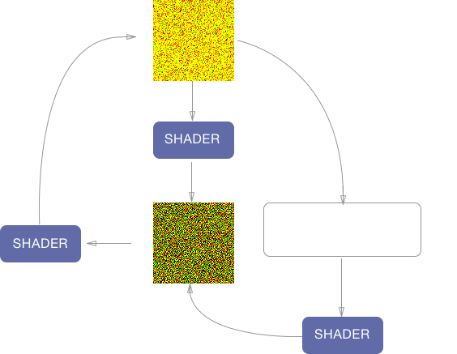

<!--.slide: data-background="./asset/img/graph-gl2.jpg" -->


# ECHARTS-GL 与有趣的可视化

沈毅

Note:

---

## ECharts 是什么

+ 拥有 <span style="color: #ffbc00">~18k star</span> 的开源前端可视化库

+ 声明式的编程接口

+ 丰富的可视化类型和交互方式

+ 大数据量展现的能力

+ 吸引眼球的动画和特效

Note:
那么 ECharts 是什么，首先它是一个基于 Canvas 的开源前端可视化库。目前在 GitHub 上已经拥有快 1w8 的 star 数了。

ECharts 提供的是一个声明式的接口，也就是说用户通过一系列配置项去描述如何展示一个图表以及交互组件，这种声明式的接口有利有弊，优点是它没有程序逻辑，上手非常简单，而且不会写程序的，比如我们的设计师，没有任何的程序基础，琢磨琢磨也能画出一个像样的图表。弊端就是它很难被扩展，需要我们提供丰富的配置项去支持用户自定义的展示，其实相当于把很多工作量转移到我们身上了，而且做不了还容易被喷。

然后几个是 ECharts 的主要特性，丰富的可视化类型以及交互组件，大数据量展现的能力，以及吸引眼球的动画和特效，这里就不细讲了。

---

## ECharts GL 又是什么？

+ ECharts 的一个扩展

+ 熟悉的配置，熟悉的味道

+ 使用 WebGL 图形接口

Note:

----

#### ECharts

```js
option = {
    xAxis: {},
    yAxis: {},
    series: [ { type: 'scatter' } ]
}
```

#### ECharts GL

```js
option = {
    xAxis3D: {},
    yAxis3D: {},
    zAxis3D: {},
    grid3D: {},
    series: [ { type: 'scatter3D' } ]
}
```

Note:
3D 的后缀是为了防止在一个图里二维组件和三维组件混搭的时候产生冲突。

----


<iframe data-src="./asset/ec-demo2/scatter-simplex.html" frameborder="0" style="width: 50%;height:600px;float:left;"></iframe>
<iframe data-src="./asset/ec-demo2/scatter3D-simplex2.html" frameborder="0" style="width: 50%;height:600px;float:left;"></iframe>

---

<iframe class="fullscreen" frameborder="0" data-src="asset/ec-demo2/hangzhou-track.html"></iframe>

Note:
这个是去年的 R 语言大会演示的一个例子。


----

<iframe class="fullscreen" frameborder="0" data-src="asset/ec-demo2/hangzhou-track-gl.html"></iframe>

Note:
我在 ECharts GL 里又重新实现了一遍这个效果

TODO
高度图

----

# 三维空间

Note:
地图多了高度，笛卡尔坐标系多了深度。

多一个维度表示数据
沉浸式的数据探索

---

## 场景

Note:
程序生成，
数据 -> 程序规则 -> 场景

灵活，可以生成高精度模型。

我们在接下来通过几个例子看看，一些常见的二维数据转到三维的场景后会有什么效果

----

## 像素

<iframe class="fullscreen" frameborder="0" data-src="asset/ec-demo2/bar3D-image-pixels.html"></iframe>


----

## 音频

Note:
音频的波形数据用折线图画出来大概就是这个样子。这只是其中的一帧，如果做音乐可视化，我们需要让整个图随着音乐的节奏动起来。

----

<iframe class="fullscreen" frameborder="0" data-src="asset/ec-demo2/scatter-music.html"></iframe>

Note:
每一个气泡都是 fft 计算音频频域的一个 bin。这是非常基础的一个音频可视化例子。

----

<iframe class="fullscreen" frameborder="0" data-src="asset/ec-demo2/bar3D-music.html"></iframe>

Note:
中间特别大的值我们还可以给它一个特别亮的颜色。这个亮度是超出屏幕所能表现的白色的。

----

## 地图

+ GeoJSON

----


<iframe class="fullscreen" frameborder="0" data-src="asset/ec-demo2/map3D.html"></iframe>

----

## 函数

Note:
如果要可视化的是一个函数的话，连输入的数据都可以是根据规则程序生成了

----

## 参数曲面

```js
u: { min: -PI, max: PI, step: PI / 20 },
v: { min: 0, max: PI, step: PI / 20 },

x: (u, v) => sin(v) * sin(u),
y: (u, v) => sin(v) * cos(u),
z: (u, v) => cos(v)

```

----

---

## 更好的效果

+ 光影

+ 材质

+ 后期

Note:
仅仅能够画出来是不够的，我们还需要画好看

----

## 光影

----

## 日光

----

## 阴影

----

## 环境光

----

## 自发光

Note:

除了外来的光源

----

## HDR + Bloom


Note:

---

## 材质

+ 真实感

+ 风格化

----

## 真实感

----

## Physically Based Rendering

Note:
实时渲染肯定很难做到离线渲染的品质和逼真程度，但是我们希望通过一些 trick 让画面达到以假乱真的品质

----

## 金属度和光泽度

Note:
https://twitter.com/marcinignac/status/864389237357117440

----

## 木质

----

----

## 风格化

Note:
风格化则是渲染的另外一个极端

----

## 描边

----

## Cross Hatching


---

## 摄影与后期

----

## 景深

----

## Motion

----

## 调色

---

# 二维加速

+ 加速绘制

+ 加速布局计算

---

## 加速绘制

Note:
串行改并行

准备好顶点数据, commit，shader中并行绘制

----

Note:
这是一个 ECharts 中绘制的航班图

----

Note:
这是用 ECharts GL 绘制的

----

---

## GPU 加速布局

----

## 力引导布局

+ 用于关系图的布局

+ 节点与节点之间模拟斥力，边模拟弹簧的引力

+ 每次迭代 O(n2), 需要上百次迭代才能结束

Note:

大家如果做过关系图布局的话应该知道关系图布局的算法主要是力引导布局。

首先介绍一下什么是力引导布局。

力引导布局是用于关系图布局的经典算法， 有很多种算法和实现，但是其基本原理都是一样的，都是节点与节点存在一个电荷的斥力，边则存在一个弹簧的引力。每次迭代通过计算每个节点的受力，并且根据受力产生一个位移，在多次迭代后整个布局的能量会趋向一个平衡，关系边多的节点间有一个聚类的趋势。

所以传统的力引导算法开销很大，因为要有上百次，每次都是 O(n2) 受力计算才能结束。为了防止布局的阻塞给用户带来的困扰，我们多会把布局过程表现出来，刚好这个动画也挺有意思的。

这个是 echarts 的力引导布局。

----

<iframe data-src="asset/ec-demo/webkit-dep.html" class="fullscreen" frameborder="0"></iframe>

Note:
这个数据大概 500 个顶点，800 条边


----

<iframe data-src="asset/ec-demo/eurosis.html" class="fullscreen" frameborder="0"></iframe>

Note:
接下来来看一个更大规模的例子，
这份数据 1285 个顶点，7586 条边

可以看到已经很卡了。

----

## 力引导布局的性能优化

+ Barnes Hut Simulation

+ 多线程？Web Worker

+ SIMD？

Note:
在算法层面力导向布局最常见的性能优化方式就是这个 Barnes Hut Simulation，它把所有节点放到一个四叉树里，然后对于一批距离远的节点可以看做一个整体计算斥力。而不用去一个点一个点的算。

在程序层面，可以通过 SIMD，多线程等方式去并行计算，也可以带来可观的优化效果。

但是 JS 并不支持多线程，现在浏览器有 WebWorker，我们可以把布局的方法在一个单独的 WebWorker 里去做，这样有一个好处是布局的代码不会阻塞到重绘的代码，交互会更顺畅。

力引导布局里有很多向量操作，所以 SIMD 也能带来显著的优化效果，但是遗憾的是只有 firefox nightly 现在才支持 SIMD。

----

<iframe data-src="asset/ec-demo/eurosis-gl.html" class="fullscreen" frameborder="0"></iframe>

Note:
刚才说到在 WebWorker 中做布局可以保证渲染的线程跟布局的线程分离，如果是单线程的话我们可能就是布局一次，渲染一次，如果布局多次就可能会阻塞渲染，导致交互不顺畅，但是用 WebWorker 我们就没这个担忧，我们可以再 Worker 中布局迭代多次后再提交给主线程渲染。这样可以有效的提高布局的速度

----

<iframe data-src="asset/ec-demo/eurosis-gl.html?5" class="fullscreen" frameborder="0"></iframe>

----

<iframe data-src="asset/ec-demo/eurosis-gl.html?10" class="fullscreen" frameborder="0"></iframe>

Note:

----

## WebGL 中实现力引导布局



Note:
一般 WebGL 实现 GPGPU 的思路就是把各式各样的数据存到纹理里，然后在 shader 里取出数据之后进过一系列计算之后再写入纹理。

----

<iframe data-src="asset/ec-demo/eurosis-gl-gpu.html" class="fullscreen" frameborder="0"></iframe>

Note:

----

<iframe data-src="asset/ec-demo/graph.html" class="fullscreen" frameborder="0"></iframe>


----

<!--.slide: data-background="./asset/img/graph-gl.jpg" -->

## 性能对比

Nodes: <span style="color: #ffbc00">22k</span>

Edges: <span style="color: #ffbc00">48k</span>

----

## 原论文

CPU without Barnes Hut: <span style="color: #ffbc00"><b>~41000 ms</b></span>

CPU with Barnes Hut: <span style="color: #ffbc00"><b>~400 ms</b></span>

Note:
这是这个力引导算法原论文给出的数字

----

<p style="font-size: 2rem;color:#ffbc00;">Macbook 13 2012</p>

CPU without Barnes Hut: <span style="color: #ffbc00"><b>~28000 ms</b></span>

CPU with Barnes Hut: <span style="color: #ffbc00"><b>~1000ms</b></span>

<p class="fragment">
    GPU: <span style="color: #ffbc00"><b>~260ms</b></span>
</p>

Note:

我先在自己的电脑上测试了一下不同算法的性能

没有 Barnes Hut 优化的一次迭代需要近 28s，加上 Barnes Hut 也需要近 1s，然后 GPU 运算的 260ms，有几倍的提升，但是这个提升不是太明显

我在想可能是 HD 4000 这张显卡太烂了，于是又在台式机上试了下。

----

<p style="font-size: 2rem;color:#ffbc00;">GTX1070, i7</p>

CPU without Barnes Hut: <span style="color: #ffbc00"><b>~12000 ms</b></span>

CPU with Barnes Hut: <span style="color: #ffbc00"><b>~300ms</b></span>

<p class="fragment">
GPU: <span style="color: #ffbc00"><b>~2ms</b></span>
</p>

Note:

---

# 与 ECharts 的组合使用

Note:
看到这个大家可能会疑惑，这已经是 ECharts 的组件了，还需要组合什么鬼。

但是其实我们可以做一些更有意思的事情。

----

## 与现有组件的无缝结合

----

## Interactive ECharts Surface

----

## D3 + ECharts + ECharts GL

----

Note:
把 ECharts 中的图形提取出来画成三维的。

---

<!--.slide: data-background="./asset/img/buildings2.jpg" -->

## Thanks


---
