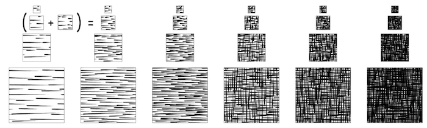

<!--.slide: data-background="./asset/img/graph-gl2.jpg" -->


# ECHARTS-GL 与有趣的可视化

沈毅

Note:

---

<!--.slide: data-background-video="./asset/video/echarts.mp4" data-background-opacity="0.4" -->

## ECharts 是什么

+ 拥有 <span style="color: #ffbc00">~18k star</span> 的开源前端可视化库

+ 声明式的编程接口

+ 丰富的可视化类型和交互方式

+ 大数据量展现的能力

+ 吸引眼球的动画和特效

Note:
那么 ECharts 是什么，首先它是一个基于 Canvas 的开源前端可视化库。目前在 GitHub 上已经拥有快 1w8 的 star 数了。

ECharts 提供的是一个声明式的接口，也就是说用户通过一系列配置项去描述如何展示一个图表以及交互组件，这种声明式的接口有利有弊，优点是它不需要程序逻辑，上手非常简单，而且不会写程序的，比如我们的设计师，没有任何的程序基础，琢磨琢磨也能画出一个像样的图表。

然后几个是 ECharts 的主要特性，丰富的可视化类型以及交互组件，大数据量展现的能力，以及吸引眼球的动画和特效，这里就不细讲了。

---

## ECharts GL 又是什么？

+ ECharts 的一个扩展

+ 使用 WebGL 图形接口

+ 熟悉的配置，熟悉的味道

+ 1.0.0-alpha.5

Note:

不像 ECharts， ECharts GL 底层使用 WebGL 作为图形接口，而且以后所有使用 WebGL 的组件都会放在 ECharts GL 中

现在还在迭代 alpha 版本，大概六月底会 release 正式版

----

<iframe class="fullscreen" frameborder="0" data-src="asset/ec-demo2/hangzhou-track.html"></iframe>

Note:
这个是去年的 R 语言大会演示的一个例子。


----

<iframe class="fullscreen" frameborder="0" data-src="asset/ec-demo2/hangzhou-track-gl.html"></iframe>

Note:
我在 ECharts GL 里又换了种效果实现。

TODO
高度图

----

#### ECharts

```js
option = {
    xAxis: {},
    yAxis: {},
    series: [ { type: 'scatter' } ]
}
```

#### ECharts GL

```js
option = {
    xAxis3D: {},
    yAxis3D: {},
    zAxis3D: {},
    grid3D: {},
    series: [ { type: 'scatter3D' } ]
}
```

Note:
3D 的后缀是为了防止在一个图里二维组件和三维组件混搭的时候产生冲突。

----


<iframe data-src="./asset/ec-demo2/scatter-simplex.html" frameborder="0" style="width: 50%;height:600px;float:left;"></iframe>
<iframe data-src="./asset/ec-demo2/scatter3D-simplex.html" frameborder="0" style="width: 50%;height:600px;float:left;"></iframe>

---

## 三维空间

+ 高度

+ 深度

+ 光影

+ 材质

+ ....

Note:
那么我们可以看到 ECharts GL 的第一个特性是它可以把可视化扩展到三维空间。

在三维空间中有更多的视觉属性可以为我们所用。

地图多了高度，笛卡尔坐标系多了深度。

多一个维度表示数据

我们也可以拥有更加沉浸式的数据探索体验

---

## 程序生成的场景

+ 数据 + 规则 + 参数

Note:
程序生成，
数据 -> 程序规则 -> 场景

灵活，可以生成高精度模型。

但是这种程序生成的场景也有缺点，就是没办法做一些耗时比较长的预计算和处理已得到更好的渲染效果了，这就需要我们后面在渲染部分花更大的功夫。

然后我们其实也在考虑把这些程序生成的场景能够导出到通用的三维模型交换格式，比如 collada，以供用户导入到三维工具中进行二次编辑和更好离线渲染。


我们在接下来通过几个例子看看，一些常见的二维数据在三维场景中是什么效果

TODO

----

## 像素

Note:
首先来看一个图片的像素数据的例子。

TODO

----

<iframe class="fullscreen" frameborder="0" data-src="asset/ec-demo2/bar3D-image-pixels.html"></iframe>

Note:

图片的像素数据呢它是二维的，每一个像素有 x, y, r, g, b, a 的属性。

我们可以把每个像素画成一个柱子。柱子的颜色就是像素的颜色

然后把每个像素计算出来的亮度映射到柱子的高度，就可以得到这个非常有意思有点像是丛林和火山的形状

----

## 音频

<iframe src="asset/ec-demo2/audio-waveform.html" width="1200" height="200" frameborder="0"></iframe>

Note:

这是一个最基础的把音频的波形可视化出来的效果，横轴是时间

----

<iframe class="fullscreen" frameborder="0" data-src="asset/ec-demo2/scatter-music.html"></iframe>

Note:

我们可以使用 WebAudio 的 API 把时域的波形图转成频域。

每一个气泡都是 fft 计算音频频域的一个 bin。这是非常基础的一个音频可视化例子。

----

<iframe class="fullscreen" frameborder="0" data-src="asset/ec-demo2/bar3D-music.html"></iframe>

Note:

同时通过镜头动画辅助表达整个音乐的节奏，可以让用户更容易被这 Motion 带入节奏。

----

## 地图


Note:
ECharts 中的地图使用的是存储行政区域或者国家轮廓的 GeoJSON 数据。我们用 Canvas 把这些轮廓画出来，在不同的国家或者行政区域填充不同的颜色。

这个是我们设计师用 echarts 制作的一张旅行城市的地图。

----

+ GeoJSON

    + Polygon

+ Triangulation


Note:
我们需要做的就是把通过三角化的算法把多边形转成更适合 WebGL 绘制的三角面。

----


<iframe class="fullscreen" frameborder="0" data-src="asset/ec-demo2/map3D.html"></iframe>

----

## 函数

<iframe src="asset/ec-demo2/polar.html" width="600" height="400" frameborder="0"></iframe>

Note:
如果要可视化的是一个函数或者方程的话，连输入的数据都可以是根据函数的规则程序生成了

----

## 参数曲面

```javascript
u: { min: -PI, max: PI, step: PI / 20 },
v: { min: 0, max: PI, step: PI / 20 },

x: (u, v) => sin(v) * sin(u),
y: (u, v) => sin(v) * cos(u),
z: (u, v) => cos(v)

```

Note:
例如参数曲面

参数曲面是三维空间中表达参数方程的曲面图。

这段代码描述的一个球面

----

<iframe class="fullscreen" frameborder="0" data-src="asset/ec-demo2/surface-sphere.html"></iframe>

----

<iframe class="fullscreen" frameborder="0" data-src="asset/ec-demo2/surface-parametric.html"></iframe>

Note:
这是一个更复杂的参数曲面例子

---

## 丰富的渲染效果

+ 光影

+ 材质

+ 后期

Note:
仅仅能够画出来是不够的，我们还需要通过各种效果把图片渲染好看

很多时候我们不喜欢三维的可视化，一方面是因为它并没有二维的那么清晰，还有一个很重要的原因是很多三维的渲染效果很糟糕，比如用着过时的光照模型。充满锯齿的画面。但是如果我们提升一下渲染的品质，把一张图渲染好看了，我相信很少会有人不喜欢。


光影是场景有立体感的主要来源。有真实感的材质能够让我们看到一个图形后立马联想到这是什么东西，后期可以模拟一些摄像机或者 ps 的效果让画面更有质感。

---

## 光影

+ 日光和阴影

+ 环境光和阴影

+ 自发光

Note:
ECharts GL 中的场景主要有两种光源，日光和环境光。这些是图形或者三维场景中的物体接受到的光照，除此之外，一些需要突出的物体可能还会有自发光。

----

## 日光

+ Lambert

Note:

日光是大部分场景中的主要光源。因为太阳距离很远，所以日光基本上是平行光，就是说在空间中任意位置光的方向都是一样的。物体表面跟光线角度大的话受到的光多，就会更亮，角度小的话更暗，这是渲染里光照最基础的 lambert 法则。也是绘画里基础的明暗法，通过这种明暗的区别可以让单调颜色的物体一下子又立体感起来。

TODO 加日光和没加日光的区别
TODO 日光示意图

----

<iframe class="fullscreen" frameborder="0" data-src="asset/ec-demo2/globe-sun.html"></iframe>

----

## 阴影


Note:
日光被遮挡的地方会产生阴影。

在图中这样建筑可视化的示例中，阴影是用来增强空间感的一个非常重要的手段，如果没有阴影，我们可能会觉得这些区域就是一片连起来的，建筑也是浮在地面上的感觉。
那么软阴影又是什么，这个软的意思就是阴影的边缘要柔和，不能太硬，这个基本上需要靠很多采样才能解决。

现在流行的实时阴影的算法就是阴影贴图，就是在灯光的视角渲染一边场景得到深度信息，然后在摄像机视角渲染场景的时候根据这张深度贴图判断这个点是否被遮挡了。因为贴图尺寸和精度的限制，阴影贴图在

----

<iframe class="fullscreen" frameborder="0" data-src="asset/ec-demo2/geo3D-shadow.html"></iframe>

Note:
这是一个三维的地图动态阴影的效果。前段时间设计圈特别流行制作长阴影，差不多就是这样的一个效果

----

## 环境光

+ Image Based Lightning


Note:
基于图片的环境光作为补充，提供了各个方向的光源，可以让场景的光照不那么单一，在一些背光面也能获取到一些光照信息而不是完全黑色的。

----


----

## 环境光的阴影

+ Screen Space Ambient Occulusion


Note:
计算环境光的阴影是一件开销非常大的事，所以实时的渲染一般都用非常取巧的屏幕空间的环境光遮蔽。

就是像这种图中那样在图形表面的半球内采样，估计一个点上面能够受到多少环境光，被其它物体包围得越多的地方就会越暗。一般实时的渲染里为了性能只会采样十几次到几十次，所以噪点会非常多，还需要一层额外的双边滤波去减少噪点。

它作为阴影的补充可以让整个画面更有层次感，不会让阴影显得很单调。

屏幕空间环境光遮蔽从 2007 年 crysis 游戏中开始火起来到现在已经十分普及了，这十年的时间，各种论文和游戏对其的改进基本上都是在如何更好的分布采样，如何推导更好的计算遮挡的表达式，以及更好的滤波减少噪点这三块上。

----


<iframe class="fullscreen" frameborder="0" data-src="asset/ec-demo2/buildings-ssao.html"></iframe>

Note:
可以看下有环境光遮蔽和没有的区别。

环境光遮蔽可以让这些挨得比较近的建筑因为光照不够显得比较暗。

----

## 自发光

Note:

除了外来的光源。有些物体它本身也会发光，而不会因为阴影的缘故无法被看到。比如各种霓虹灯，这些因为自发光而高亮的点非常容易吸引人的注意力

----

<iframe class="fullscreen" frameborder="0" data-src="asset/ec-demo2/globe-night.html"></iframe>

Note:
比如我们拿这张夜晚的图片放到地球上，它里面的星星点点的灯光就属于灯光的自发光。它们不会受太阳暗面的影响，反而因为其它地方都暗下来了，更容易突出哪些地方比较繁华，大些地方夜生活比价少，哪些地方几乎没有人烟。

----

## 更强的颜色亮度

+ 高动态范围 HDR

+ Tone Mapping(ACES)

+ Bloom

Note:

我们平时写代码的时候，比如在页面里面设置颜色，或者可视化里做颜色映射，大部分是使用 0 到 255 的 RGB 颜色空间。一方面是因为大部分图片格式或者标准只支持 0 - 255 的范围，所以能表达的最亮的颜色也就是白色了。

但是我们平时在现实生活中，看纸上的白色，或者屏幕的白色，或者太阳的白色，感受到的亮度的其实是不一样的。如果你从很亮的室外一下子进入室内，你会觉得原本室内看起来很亮的东西变得特别暗，这是因为眼睛会根据进入光线的强度自动调节你瞳孔的大小。也就是说很多亮度只有其实只有在有对比的情况下才能被感知。这也是高动态范围 HDR 存在的意义。

我们刚才加了这么多光照，光照稍微强一点的话就超出 RGB 的范围了。这样屏幕上一片白色，一是看不出什么有用的信息，二是无法通过对比去显示出真正很亮的颜色。

我们需要一个更高的精度去准确存储每个像素颜色的强度方便后期去调整到合适的色调范围。

同时后期模拟眼睛的自适应，通过 Tone Mapping 去调整到合适的色调范围，

Bloom 是配合 HDR 使用，用来模拟高光溢出效果的一个后期效果。

----

<iframe class="fullscreen" frameborder="0" data-src="asset/ec-demo2/bloom.html"></iframe>

Note:

这是一个 Bloom 效果的例子
它会找出 HDR 图像中超过一定阈值的颜色，然后多层高斯模糊后再与原图像混合，混合得到图像，模拟了高光在镜头或者眼中的溢出效果。

这种高强度的亮度很容易一下子就吸引人的注意力。

---

## 材质

+ 真实感

+ 风格化

Note:
渲染的第二块是材质

渲染里的材质有两个极端，一种是追求真实，要真实感，还有一种是风格化，比如模拟卡通效果，电子效果，素描效果等等。不管是真实感还是风格化，材质的存在都是为了能够让人看到这个东西后一下就产生代入感和沉浸感。

----

## 真实感

----

## Physically Based Rendering

+ HDR 的环境光照贴图

+ 对环境光照的积分预计算（prefilter）

+ 能量守恒的光照公式

+ <s>经验模型</s> 直观的公式参数。


Note:

GL 的真实感渲染主要是基于 PBR 的材质。大家如果玩游戏的话可能有听过这个词。

一般基于物理的渲染有这么几点，首先刚才提到过的它需要一张环境光照贴图。这个贴图格式是 HDR 的，刚才提到过更大范围的颜色可以表达更丰富的光照强度。

然后因为光照计算需要做积分计算这张环境贴图里每一个像素产生光照贡献，如果是实时做的话就会性能很差，所以一般会对这张环境光照的贴图做积分的预计算。得到右边这张看起来像是被模糊了的图。这种预计算的卷积可能不是完全正确的结果，但是足够以假乱真了。实际上实时渲染基本上就是在用各种 trick 去实现以假乱真的效果。

Ok，然后最后我们再使用一个能量守恒的光照公式应用到像素上。


// 实时渲染肯定很难做到离线渲染的品质和逼真程度，但是我们希望通过一些 trick 让画面达到以假乱真的品质

----

## 金属和光泽度

+ metalness

    + 0 金属

    + 1 非金属

+ roughness

    + 0 完全光滑

    + 1 完全粗糙

Note:

金属度和光泽度是刚才提到的公式中非常重要的两个参数，这两个参数是 normalize 后的，比如金属度 metalness，0 就是非金属，1就是金属，0 - 1 之间的值实际上是两者之间的插值，用得比较少。roughness 的话 0 就是全光滑

----

<iframe class="fullscreen" frameborder="0" data-src="asset/ec-demo2/globe-material.html"></iframe>

Note:
金属和非金属有个区别是因为菲尼尔反射的参数不一样，上面的塑料材质的边缘视角和平面角度小反射比较强，中间正对着的反射比较弱，金属的是不管什么角度反射都差不多。

----

#### Metalness Map


#### Roughness Map


Note:
为了描述更复杂的材质，我们可以把描述材质的属性存到各个纹理上。这样就可以精确到像素的去描述每个像素的材质了。

----

<iframe class="fullscreen" frameborder="0" data-src="asset/ec-demo2/surface-complex-material.html"></iframe>

Note:
比如这么一个生锈的零件

----

## 风格化

Note:
风格化则是渲染的另外一个极端

----

## 描边

+ Sobel 边缘检测

+ Depth + Normal

Note:
我们使用基于 Depth + Normal 的 sobel 算子提取图像的边缘，如果只是用 Normal 容易产生改被检测到但是没被检测到的情况，如果只使用 depth 则容易出现不是边缘但是却发生了误判的情况。

----


<iframe class="fullscreen" frameborder="0" data-src="asset/ec-demo2/bar3D-edge.html"></iframe>

Note:
描边除了有卡通效果外，还有可以有效的去分离每个图形。

----

## Cross Hatching

Note:
Cross Hatching 在有些场景下有奇效

----

## Tonal Art Maps



Note:
Tonal Art Maps 是一系列预先生成的线稿，黑点的交叉线比较多，白点的交叉线则比较少。在渲染的时候会根据像素受到光照的强度去索引这些贴图。为了做到不同贴图的平滑过渡，会对色调所在范围的前后两个贴图做线性的插值。

----


<iframe class="fullscreen" frameborder="0" data-src="asset/ec-demo2/surface-hatching.html"></iframe>

Note:

不知道下面有没有学习绘画的朋友，想到自己练习速写的日子。

----

<iframe class="fullscreen" frameborder="0" data-src="asset/ec-demo2/buildings-hatching.html"></iframe>


---

## 摄影与后期

Note:

渲染的第二块加一些摄影中常见的镜头效果以及后期处理

----

## 景深


----

<iframe class="fullscreen" frameborder="0" data-src="asset/ec-demo2/bar3D-dof.html"></iframe>

Note:
景深可以让整个场景有一种微缩模型的感觉

----

<iframe class="fullscreen" frameborder="0" data-src="asset/ec-demo2/globe-dof.html"></iframe>

Note:
景深焦散所带来的光斑也让整个画面更有德味

----

## 调色 Color Grading


Note:
当然跟摄影一样，你可能会对图片出来的整个色调不满意，所以一般再会有一个颜色纠正的操作，

TODO
其它更多数字艺术的作品, Glitch, Dot Screen

---

## 渐进增强

+ 将采样分布到多帧中

+ 交互的时候能够立刻反馈

+ 停止交互后渐进增强画面

Note:
前面提到的效果，比如环境光遮蔽，都是需要大量的采样才能达到比较好的效果，还有比如锯齿本质上也是因为屏幕像素有限时对几何边缘采样不足导致的。

----


Note:
左边是没有渐进式增强而且效果配置比较低的，右边是同样的配置但是渐进式增强后的画面，可以看到画面质量提升了很多，包括像这些高频部分更加平滑，还有线条的质量，阴影的质量，都有了很大的改善。

---

## 二维加速

+ 绘制

+ 布局计算

---

## 加速绘制

Note:
串行改并行

Canvas 对于图形的重绘往往是串行的，就是绘制完一个图形后再绘制下一个，而且它在绘制一个矢量图形的时候需要做很多工作，画一条贝塞尔曲线，需要对这个贝塞尔曲线细分成很多细微的线段，然后对于比较粗的线再用三角面去模拟这个线段，所以绘制一条线的开销是比较大的，大家仔细留意下的话也可以发现 chrome 在画比较粗的线段会慢十倍都不止，这是因为粗的线段必须要用三角面模拟，而且还要计算线连接处的导角，这些都是计算量比较大的东西。

WebGL 中画线也需要我们自己计算这些东西，但是它可以做到初始化计算好后一直使用，而且后面多条线段的绘制都是在 GPU 中并行的。

TODO

----

<iframe data-src="./asset/ec-demo/airline.html" class="fullscreen front" frameborder="0"></iframe>

Note:
这是一个 ECharts 中绘制的航班图

----

<iframe data-src="./asset/ec-demo/airline-gl.html" class="fullscreen" frameborder="0"></iframe>

Note:
这是用 ECharts GL 绘制的

---

## GPU 加速布局

----

## 力引导布局

+ 用于关系图的布局

+ 节点与节点之间模拟斥力，边模拟弹簧的引力

+ 每次迭代 O(n2), 需要上百次迭代才能结束

Note:

大家如果做过关系图布局的话应该知道关系图布局的算法主要是力引导布局。

首先介绍一下什么是力引导布局。

力引导布局是用于关系图布局的经典算法， 有很多种算法和实现，但是其基本原理都是一样的，都是节点与节点存在一个电荷的斥力，边则存在一个弹簧的引力。每次迭代通过计算每个节点的受力，并且根据受力产生一个位移，在多次迭代后整个布局的能量会趋向一个平衡，关系边多的节点间有一个聚类的趋势。

所以传统的力引导算法开销很大，因为要有上百次，每次都是 O(n2) 受力计算才能结束。为了防止布局的阻塞给用户带来的困扰，我们多会把布局过程表现出来，刚好这个动画也挺有意思的。

这个是 echarts 的力引导布局。

----

<iframe data-src="asset/ec-demo/webkit-dep.html" class="fullscreen" frameborder="0"></iframe>

Note:
这个数据大概 500 个顶点，800 条边


----

<iframe data-src="asset/ec-demo/eurosis.html" class="fullscreen" frameborder="0"></iframe>

Note:
接下来来看一个更大规模的例子，
这份数据 1285 个顶点，7586 条边

可以看到已经很卡了。

----

## 力引导布局的性能优化

+ Barnes Hut Simulation

+ 多线程？Web Worker

+ SIMD？

Note:
在算法层面力导向布局最常见的性能优化方式就是这个 Barnes Hut Simulation，它把所有节点放到一个四叉树里，然后对于一批距离远的节点可以看做一个整体计算斥力。而不用去一个点一个点的算。

在程序层面，可以通过 SIMD，多线程等方式去并行计算，也可以带来可观的优化效果。

但是 JS 并不支持多线程，现在浏览器有 WebWorker，我们可以把布局的方法在一个单独的 WebWorker 里去做，这样有一个好处是布局的代码不会阻塞到重绘的代码，交互会更顺畅。

力引导布局里有很多向量操作，所以 SIMD 也能带来显著的优化效果，但是遗憾的是只有 firefox nightly 现在才支持 SIMD。

----

<iframe data-src="asset/ec-demo/eurosis-gl.html" class="fullscreen" frameborder="0"></iframe>

Note:
刚才说到在 WebWorker 中做布局可以保证渲染的线程跟布局的线程分离，如果是单线程的话我们可能就是布局一次，渲染一次，如果布局多次就可能会阻塞渲染，导致交互不顺畅，但是用 WebWorker 我们就没这个担忧，我们可以再 Worker 中布局迭代多次后再提交给主线程渲染。这样可以有效的提高布局的速度

----

<iframe data-src="asset/ec-demo/eurosis-gl.html?5" class="fullscreen" frameborder="0"></iframe>

----

<iframe data-src="asset/ec-demo/eurosis-gl.html?10" class="fullscreen" frameborder="0"></iframe>

Note:

----

## WebGL 中实现力引导布局


Note:
一般 WebGL 实现 GPGPU 的思路就是把各式各样的数据存到纹理里，然后在 shader 里取出数据之后进过一系列计算之后再写入纹理。

----

<iframe data-src="asset/ec-demo/eurosis-gl-gpu.html" class="fullscreen" frameborder="0"></iframe>

Note:

----

<iframe data-src="asset/ec-demo/graph.html" class="fullscreen" frameborder="0"></iframe>


----

<!--.slide: data-background="./asset/img/graph-gl.jpg" -->

## 性能对比

Nodes: <span style="color: #ffbc00">22k</span>

Edges: <span style="color: #ffbc00">48k</span>

----

## 原论文

CPU without Barnes Hut: <span style="color: #ffbc00"><b>~41000 ms</b></span>

CPU with Barnes Hut: <span style="color: #ffbc00"><b>~400 ms</b></span>

Note:
这是这个力引导算法原论文给出的数字，论文里没给出具体环境参数，我实际上测的时候在多核的 CPU 下是挺快的

----

<p style="font-size: 2rem;color:#ffbc00;">Macbook 13 2012</p>

CPU without Barnes Hut: <span style="color: #ffbc00"><b>~28000 ms</b></span>

CPU with Barnes Hut: <span style="color: #ffbc00"><b>~1000ms</b></span>

<p class="fragment">
    GPU: <span style="color: #ffbc00"><b>~260ms</b></span>
</p>

Note:

我先在自己的电脑上测试了一下不同算法的性能

没有 Barnes Hut 优化的一次迭代需要近 28s，加上 Barnes Hut 也需要近 1s，然后 GPU 运算的 260ms，有几倍的提升，但是这个提升不是太明显

我在想可能是 HD 4000 这张显卡太烂了，于是又在台式机上试了下。

----

<p style="font-size: 2rem;color:#ffbc00;">GTX1070, i7</p>

CPU without Barnes Hut: <span style="color: #ffbc00"><b>~12000 ms</b></span>

CPU with Barnes Hut: <span style="color: #ffbc00"><b>~300ms</b></span>

<p class="fragment">
GPU: <span style="color: #ffbc00"><b>~2ms</b></span>
</p>

Note:

----

<!--.slide: data-background-video="./asset/video/gpgpu.mp4"  -->

----

<iframe data-src="asset/ec-demo2/graphGL-large.html" class="fullscreen" frameborder="0"></iframe>

---

## D3 + ECharts + ECharts GL

Note:
最后我再讲一个前段时间做的 D3 和 ECharts 结合使用的例子

----

<!--.slide: data-background="../asset/img/globe-contour-idea.jpg"  -->

----

<video autoplay loop data-src="../asset/video/contour.mp4"></video>

----

<iframe data-src="asset/ec-demo2/globe-contour.html" class="fullscreen" frameborder="0"></iframe>

----

<iframe data-src="asset/ec-demo2/globe-contour2.html" class="fullscreen" frameborder="0"></iframe>

---

<!--.slide: data-background="./asset/img/buildings2.jpg" -->

## Thanks


---
