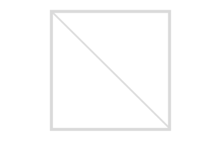
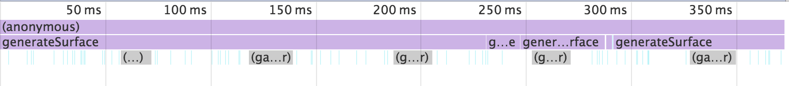
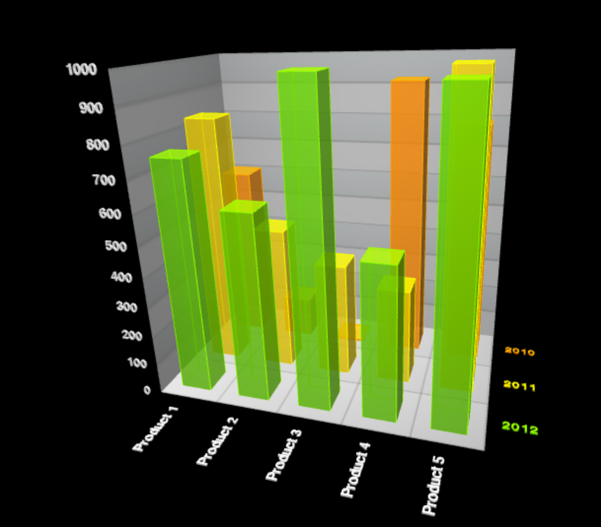
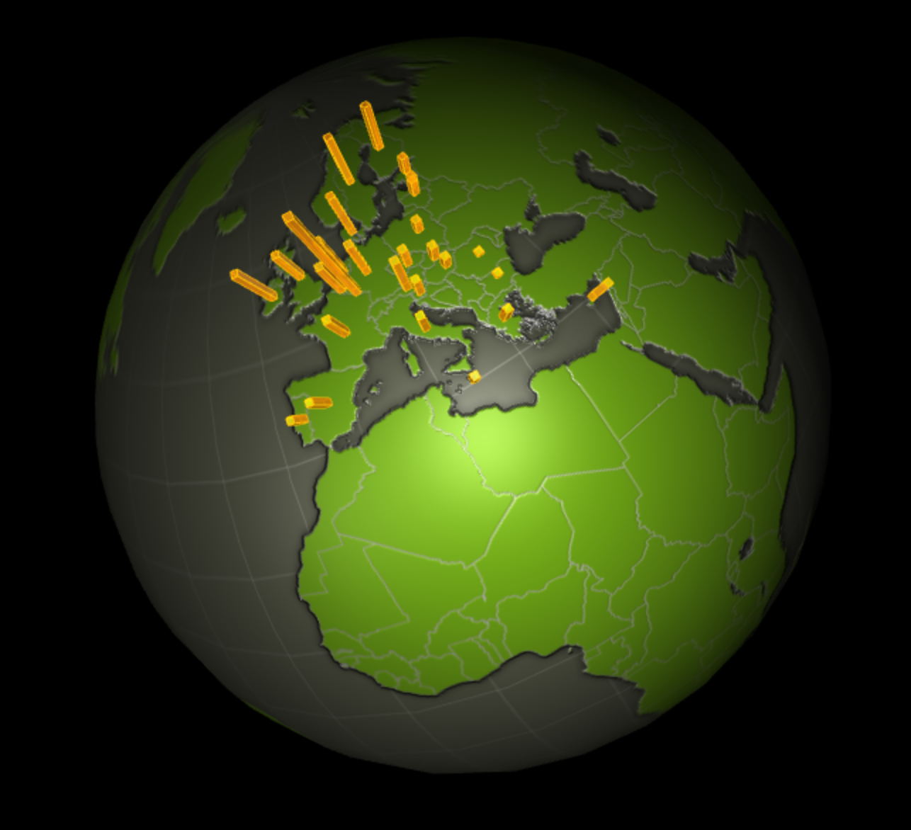
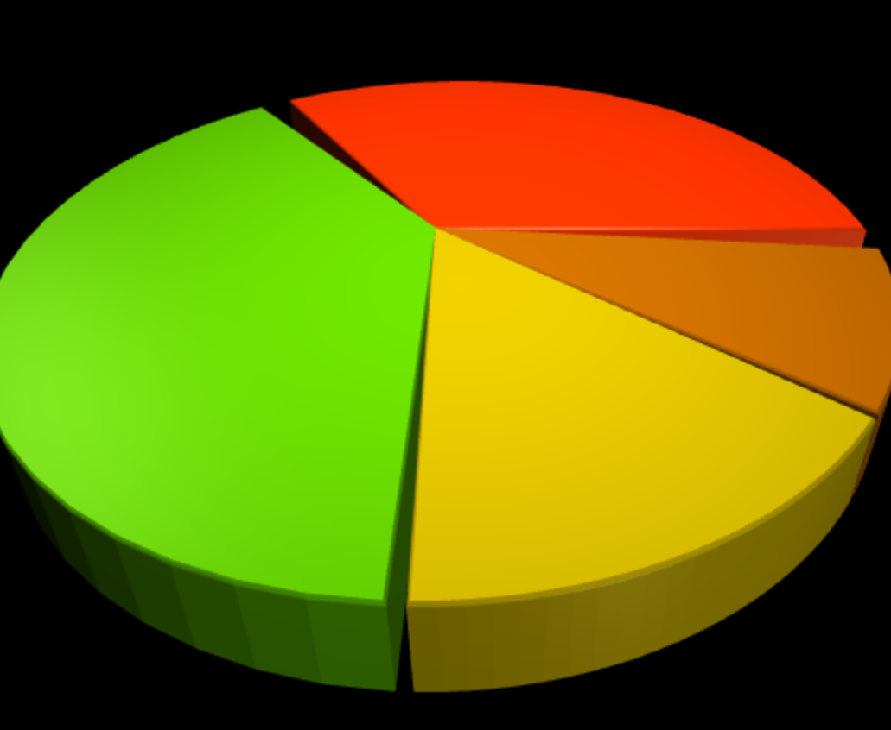
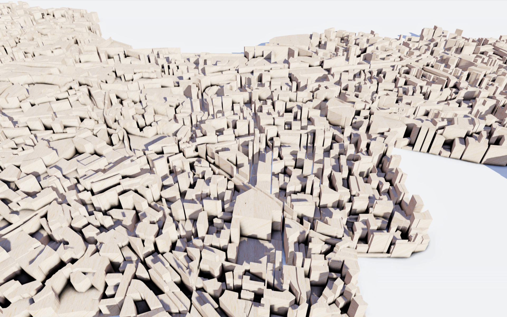
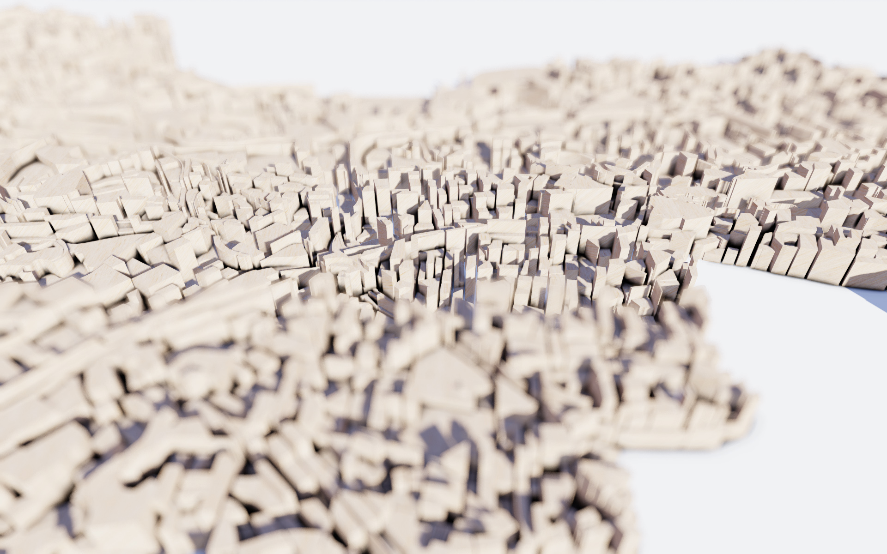
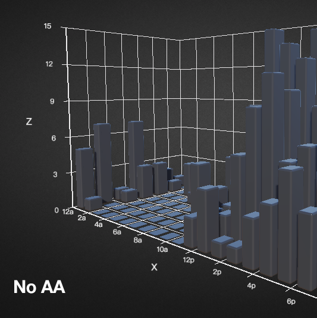
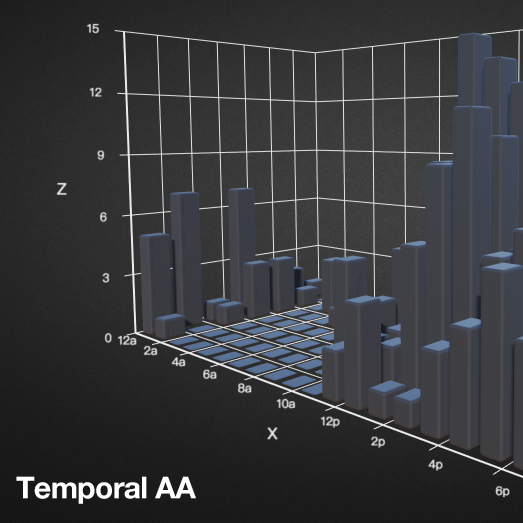

<!--.slide: data-background="./asset/img/graph-gl2.jpg" -->


# WebGL 在数据可视化中的实践

沈毅

Note:
这次分享我要介绍我们最近尝试用 WebGL 实践数据可视化中碰到的一些问题和解决方案。
具体的可视化方面的知识也会穿插着介绍。

---

<!--.slide: data-background-video="./asset/video/showreel.mp4" data-background-opacity="0.5" -->

## About Me

+ <b>WebGL</b> <small>2011</small>

+ <b>Canvas</b> <small>2013</small>

+ <b>ECharts</b> <small>2014</small>

+ <b>qtek</b> <small>2013</small>

Note:


---

## 大纲

+ ECharts 简介

+ 为什么选择 Canvas 及 Canvas 的限制

+ WebGL 与 ECharts 的结合

    + 三维空间的可视化

    + 在前端实现高品质的渲染

    + 利用 WebGL 加速力引导布局

Note:

这次分享我首先会花个几分钟大概介绍一下我们现在在维护的开源可视化库 ECharts，讲一下为什么我们开始会选择使用 Canvas 以及 Canvas 的限制，然后我们这次的重点是，就像标题说的，着重讲 WebGL 在 echarts 里的应用，包括三部分内容。

第一块是介绍在用 WebGL 绘制三维图表中常见的点线面时碰到的一些坑以及解决方案。
第二块是如何让画出来的三维可视化作品更有逼格，更酷炫。我们可以把它叫可视化的艺术化。
第三块会讲我们如何利用 WebGL 将力引导布局的效率提升了上百倍，这一块涉及 GPU 的通用计算，希望能够给大家带来一些不一样的新思路。

---

## ECharts 是什么

+ 拥有 <span style="color: #ffbc00">17k star</span> 的开源前端可视化库

+ 声明式的编程接口 <!-- .element: class="fragment highlight-current-blue" -->

+ 丰富的可视化类型和交互方式 <!-- .element: class="fragment highlight-current-blue" -->

+ 大数据量展现的能力 <!-- .element: class="fragment highlight-current-blue" -->

+ 吸引眼球的动画和特效 <!-- .element: class="fragment highlight-current-blue" -->

Note:
那么 ECharts 是什么，首先它是一个在 GitHub 上拥有 1w7k star 的基于 Canvas 的开源前端可视化库。

ECharts 提供的是一个声明式的接口，用户通过一个配置项集去描述如何展示一个图表以及交互组件，这种声明式的接口有利有弊，利是它没有程序逻辑，上手非常简单，而且不会写程序的，比如我们的设计师，琢磨琢磨也能画出一个像样的图表。弊端就是它能描述的东西也比较受限，需要我们提供丰富的配置项去支持用户自定义的展示，其实相当于把很多工作量转移到我们身上了，而且做不了还容易被喷。

然后几个是 ECharts 的主要特性，丰富的可视化类型以及交互组件，大数据量展现的能力，以及吸引眼球的动画和特效，这里就不细讲了。

----

## 为什么选择 Canvas？

+ 更灵活的性能优化 <!-- .element: class="fragment highlight-current-blue" -->

+ 像素操作的能力 <!-- .element: class="fragment highlight-current-blue" -->

+ 能够和 WebGL 更好的结合 <!-- .element: class="fragment highlight-current-blue" -->

Note:

可以说 ECharts 最先打的招牌，或者说很多人对 ECharts 感兴趣就是因为 ECharts 基于 Canvas 实现，性能优良，能够绘制十几万的大规模散点图。这个十几万像素就是我们基于 canvas 的特性专门优化的。

不过现在比较尴尬的是，浏览器对 SVG 的性能提升非常大，特别是 chrome 某个版本 SVG 的性能有巨大的提升，如果不是专门优化过的通用场景，Canvas 并没有太大的优势，而且像小米手机的移动端 Canvas 性能非常糟糕，所以我们其实有在考虑再底层实现一套 SVG 的绘图接口。

然后是像素操作的能力，这点依旧是 SVG 无法实现的，基于像素处理我们可以绘制几十上百万的数据，也可以做图片的处理，或者尾迹特效等等。。

还有与 WebGL 更好的结合，Canvas 可以直接作为纹理给 WebGL 使用。

----

## 越来越复杂的需求

+ 我要三维图表

+ 我要显示几十万的数据

+ 我要一秒内能够完成关系图布局

+ 我要大屏上酷炫的特效


Note:
但是，随着 echarts 的用户越来越多，我们也会收到各种各样更复杂的需求。比如 GitHub 上月经的 issue，问 ECharts 有没有三维的图表，ECharts 最多能够展示多少量级的数据，为什么我才十万的数据就卡卡的了，

我要一秒内能够完成关系图布局这个是上次去浙大 CAD 实验室交流的时候一个同学问我们的一个问题，因为他们之前接手的一个项目有这个需求，然后用了一些取巧的手段去实现了，问 echarts 有没有什么思路实现这种快速的布局，当时想了想并没有什么太好的办法，包括经常有人会问的力引导布局为什么不能关闭动画，我们只能很无奈的回复使用动画是因为力引导布局需要很多次的迭代，如果关闭动画就容易导致浏览器假死，所以这是个 feature 不是个 bug。

----

## 越来越力不从心的 Canvas

+ 画路径还是矢量的方式

+ 只能“软渲染”三维图形

Note:
对于这些需求，Canvas 也显得越来越力不从心

Canvas 画路径本质上还是矢量的方式，就算有 GPU 加速，为了画个圆浏览器的底层图形库还是需要做很多事，将圆转成贝塞尔曲线，细分顶点，三角化(GrAAConvexTessellator)等等。所以往往浏览器一帧画几千个圆就已经比较卡了。

还有因为 Canvas 还是个二维的绘图接口，它很难胜任复杂点的三维绘制工作，第一点就是刚才提到的性能限制，还有这种“软渲染”的方式在三角面片交叉的时候没法正确处理，这在早期的 Flash 三维引擎中也存在这个问题。

不过 Canvas 软渲染还是有优势的，就是浏览器兼容性比较好，现代浏览器上都能跑。

----

<iframe data-src="./asset/ec-demo/airline.html" class="fullscreen front" frameborder="0"></iframe>

Note:
这个飞机航线的可视化例子就非常明显了，ECharts 能够把它画出来，但是想要交互，就非常非常卡。

---


## 新世界的大门 <!-- .element: class="fragment" -->


Note:
Canvas 也解决不了的，那我们只能寄希望与 WebGL 了。

对 echarts 有所了解的同学应该知道两年前出的 echarts-x，echarts-x 是我们在 echarts 产品中对 WebGL 的首次尝试，其中获取了不少经验，也碰到了不少问题，比如在 echarts 2 的架构下对于新图表的扩展其实比较受限，所以当时只做了一个地球的可视化就没做下去了。后来我们设计 echarts 3 架构的过程中把可扩展性作为很重要的一个点，会考虑是否能够去扩展底层新的图形接口，是否能够扩展新的坐标系，新的图表和组件等等。

----

<!--.slide: data-background-video="./asset/video/baidu-screen.mp4" data-background-opacity="0.2" -->

## WebGL 能够带来什么

+ 三维场景的绘制  <!-- .element: class="fragment highlight-current-blue" -->

+ 二维绘制的性能提升  <!-- .element: class="fragment highlight-current-blue" -->

+ GPU 通用计算(GPGPU)  <!-- .element: class="fragment highlight-current-blue" -->

+ 更加酷炫的效果 <!-- .element: class="fragment highlight-current-blue" -->

Note:

WebGL 能给我们带来什么？首先是它的老本行，三维场景的绘制。比如这一页背景视频是我们帮百度世界大会开发的一个大屏，里面的场景都是三维的。
然后是二维可视化的性能提升，比较多的就是用 WebGL 在地图上打很多很多点。
然后是 GPU 的通用计算，这一块可能是大家不太能想到的，因为 GPU 天生的并行性，所以很多开发者会尝试在 GPU 上去加速一些适合并行算法，比如解矩阵，物理中的布料运算等等。
最后就是 WebGL 能够给我们给我们带来更多炫酷的效果，背景视频里面各种各样的特效都是用 WebGL 绘制的。

----

<iframe data-src="./asset/ec-demo/airline-gl.html" class="fullscreen" frameborder="0"></iframe>

Note:
这个是同样的航线数据，通过 WebGL 可视化出来的效果，我们可以已经可以实时的交互，缩放浏览，甚至还能加入粒子飞行的特效。


---


能力越大

## 坑越大 <!-- .element: class="fragment" -->

Note:
但是，俗话说得好，能力越大，坑越大，在 ECharts 集成 WebGL 的过程中，包括平时我自己在做其它的 WebGL 项目的时候，基本上是一路踩着各种各样的坑过来的。

----

## WebGL 的使用和坑

+ 三维图表的绘制 <!-- .element: class="fragment highlight-current-blue" -->

+ 前端实现高品质的渲染 <!-- .element: class="fragment highlight-current-blue" -->

+ 利用 WebGL 加速力引导布局 <!-- .element: class="fragment highlight-current-blue" -->

Note:
所以接下来我会分为这三块去介绍我们使用 WebGL 的一些经验。

---


<!--.slide: data-background="./asset/img/bar3D.jpg" data-background-opacity="0.2" -->

# 三维图表

----

<div class="fullscreen">
    <iframe data-src="./asset/ec-demo/scatter3D-simple.html" frameborder="0" style="width: 50%;height:50%;float:left;"></iframe>
    <iframe data-src="./asset/ec-demo/line3D-simple.html" frameborder="0" style="width: 50%;height:50%;float:left;"></iframe>
    <iframe data-src="./asset/ec-demo/bar3D-simple.html" frameborder="0" style="width: 50%;height:50%;float:left;"></iframe>
    <iframe data-src="./asset/ec-demo/surface-simple.html" frameborder="0" style="width: 50%;height:50%;float:left;"></iframe>
</div>

Note:
像现在这些直角坐标系上的散点图，折线图，柱状图都可以加一个 Z 轴扩展到三维空间，还有三维空间上表示趋势的曲面图。

---

总结起来就是

## 点 · 线 · 面 <!-- .element: class="fragment" -->

Note:
这些三维的可视化，总结起来就是画点线面。

点拥有颜色，形状，三维空间中的位置等属性。
线用于连接点，可以表示起点和终点，比如飞机航线，也可以用于表示数据的走势
面可以通过面积表示数据的大小，三维中面也可以用来表示一个平面上数据的走势。

---

## 画好三维的点线面

Note:
所以画好点线面，在三维可视化中非常重要，这些在  Canvas 里非常简单，比如画点用 fillRect，画线用 stroke，画面用 fill 就可以了。

---

<!--.slide: data-background="./asset/img/scatter3d.jpg" data-background-opacity="0.3"  -->

## 点

+ 三维空间的位置

+ 颜色

+ 形状

+ 大小

Note:
一个点拥有颜色，形状，三维空间中的位置等属性。

打点是最常见的一种数据可视化方式，比如刚刚的微博签到图就通过在地图打点的方式标出不同地区微博的使用程度。

同时打点也是常见的一个很多人会用 WebGL 加速绘制的对象。因为其实现简单，见效快。

----

#### JavaScript
```javascript
gl.drawArrays(gl.POINTS, 0, 100);
```

#### Vertex
```glsl
attribute float size;

gl_PointSize = size;
```

#### Fragment
```glsl
gl_FragColor = vec4(1.0);
```

Note:
WebGL 自带画点的模式，你只要在 drawArrays，就是 WebGL 最后调用的绘制命令，声明模式为画点的模式，然后在 shader 里直接绘制一个点了，而且还可以设置 gl_PointSize 设置这个方块点的大小。

这种方式非常快，因为它需要的顶点数量很少，而且不需要构建三角面，代码也简单，往往瓶颈在显卡的像素填充率上。

而且这种画点的方式还有一个好处，它是屏幕空间大小的，就是不管怎么缩放都是这个 5 个像素的大小，这样有什么好处呢，刚才提到点可以通过大小去表示数据，那如果不是屏幕空间的恒定大小的，而是有透视近大远小的话，就没法准确的去通过大小去表达数据了

----

## 不同形状的点

+ 把形状用白色填充到 Canvas 上作为纹理


```glsl
gl_FragColor = color * texture2D(sprite, gl_PointCoord);
```

Note:
使用 gl_PointSize 扩展后的点都是方块，如果我们需要自定义的形状，例如常见的圆形，三角形，就需要 Canvas 来帮忙了，我们可以预先把这个形状绘制在一个 Canvas 上，然后用这个 Canvas 作为点的纹理。

而且 WebGL（OpenGL）非常贴心的提供了一个 gl_PointCoord 的内置变量。

----

<iframe data-src="asset/ec-demo/scatter3D-simplex.html" class="fullscreen" frameborder="0"></iframe>

Note:
基本上这样就能画出刚才背景图那个散点图了。

这是三维的 simplex noise。

----

## Texture Atlas

```glsl
varying vec2 v_Uv0;
varying vec2 v_Uv1;
```

```glsl
gl_FragColor = color * texture2D(
    sprite, mix(v_Uv0, v_Uv1, gl_PointCoord)
);
```

Note:
在一个图表里有各种各样的形状的时候，我们需要用 texture atlas 来存放这些图形的形状，texture atlas 就跟雪碧图一样，把所有图片都存在一张纹理上，然后通过指定左上角和右下角索引。

这个 v_Uv0 就是点的左下角纹理坐标，v_Uv1 是点的右下角纹理坐标。用 gl_PointCoord 插值后可以得到每个像素的纹理坐标。

----

## 描边？

+ 画轮廓线 <!-- .element: class="fragment highlight-current-blue" -->

+ 单独再创建一张描边的纹理 <!-- .element: class="fragment highlight-current-blue" -->

+ 单纹理中描边和填充用颜色区分 <!-- .element: class="fragment highlight-current-blue" -->

+ Signed Distance Field <!-- .element: class="fragment highlight-blue" -->

Note:
刚刚我们解决了绘制的问题，还有个问题就是如何描边，可视化里描边可以让混在一起的图形更清晰的被区分开来。

有几种手段：

1. 画轮廓线，这个的开销太大，所以直接可以 pass 了。
2. 单独创建一张描边的纹理。
3. 在创建纹理的时候也提供描边，但是用不同颜色区分。
4. 使用 Signed Distance Field，我们最后选择了这个方案，因为它有几个前面方案无法比拟的优势，后面会讲到。

----

<!--.slide: data-background-iframe="./asset/ec-demo/sdf-heatmap.html" -->

## Signed Distance Field

+ 存储到图像边缘的距离  <!-- .element: class="fragment highlight-current-blue" -->

+ Shader 中根据这个距离填色  <!-- .element: class="fragment highlight-current-blue" -->

```glsl
float d = texture2D(sprite, gl_PointCoord).r;
// Antialias
gl_FragColor.a *= smoothstep(0.5 - smoothing, 0.5 + smoothing, d);
```

Note:
Signed Distance Field 用来表示到曲线和曲面的距离场，方便 shader 里根据这个距离场构建曲面或者曲线，valve 早些年发表了一篇论文用它来绘制矢量文字，相比普通的纹理贴图或者 alpha test，它的存储空间很小，而且放大后依然很清晰，

我们要做的就是先根据一张 symbol 的图生成一个 SDF，

----

## 优势

+ 存储空间小，放大后也有清晰的边缘  <!-- .element: class="fragment highlight-current-blue" -->

+ 能实现外发光，投影  <!-- .element: class="fragment highlight-current-blue" -->

Note:
SDF 相比于普通的纹理图片来说有一些比较显著的优势。

----

<iframe data-src="asset/ec-demo/sdf-compare.html" class="fullscreen" frameborder="0"></iframe>

Note:

上面这一层就是我们生成的距离场图了，32x32 的大小，中间是根据距离场在 shader 中绘制出来的结果，可以看到就算放大了几倍也很清晰，最下面这种作为对比就是把一张同样大小的纹理贴图直接放大的结果，

TODO:
外发光

---

<!--.slide: data-background="./asset/img/alirline.jpg" -->
## 线

+ 折线

+ 飞线

+ 轮廓线

+ 网格线

Note:
echarts-gl 里有很多需要画线的地方，除了三维的折线图，飞线图等，笛卡尔坐标系，各种轮廓，网格也需要画线。所以能够实现高质量的，各种场景下稳定展现的线的绘制非常重要。

----

## 原生态画线

```js
gl.lineWidth(5);
gl.drawArrays(gl.LINES, 0, 100);
```

+ gl.LINES

+ gl.LINE_STRIP

+ gl.LINE_LOOP

Note:
跟刚才画点一样，WebGL 本身也支持画线的模式，而且还支持多中画线的配置。看起来很美好。实际上老版本的 echarts-x 就是这么画飞线的。

----

## 但是

----

## 原生画线方法的各种坑

+ 不同的显卡驱动下画线的效果会有细微区别 <!-- .element: class="fragment highlight-current-blue" -->

+ 无法控制 lineJoin 和 lineCap <!-- .element: class="fragment highlight-current-blue" -->

+ 有最大线宽的限制，而且 Windows 下最大只有 1 <!-- .element: class="fragment highlight-blue" -->

Note:

实际上 WebGl 画线并没有 lineJoin 和 lineCap 的效果

windows 下因为 ANGLE 的原因最大线宽只有 1。

----

## 三角化线段

<iframe data-src="asset/ec-demo/line3D-wireframe.html" style="width:100%;height:500px;" frameborder="0"></iframe>

Note:
虽然说抛弃自带的画线接口很可惜，但是没办法，我们只能重新实现一遍线段的绘制。
做法就是如图用两个三角面组成一个线段。

// TODO
示意图

----

## 实现屏幕空间固定宽度

```glsl
vec2 dirA = normalize(currScreen - prevScreen);
vec2 dirB = normalize(nextScreen - currScreen);
vec2 tanget = normalize(dirA + dirB);

len *= 1.0 / max(dot(tanget, dirA), 0.5);
offset = tanget;

offset = vec2(-offset.y, offset.x) * len;
currScreen += offset;
```

Note:
如果是在传入 GPU 之前就把顶点构建好，没法实现屏幕空间宽度，也就是没办法保证视角放大缩小后线宽是一致的。
需要在顶点着色器中先变换到屏幕坐标，再移动顶点屏幕空间的宽度。

Miter Limit ?

---

## 面

+ 三角面 <!-- .element: class="fragment highlight-current-blue" -->

+ 程序生成 <!-- .element: class="fragment highlight-current-blue" -->

Note:
刚演示了单个的顶点，两个顶点组成的线段，而三个顶点组成的三角面是面绘制的基础，它也是游戏中几乎所有的三维场景绘制的基础。

在游戏中三角面都是通过建模工具生成的，而在 echarts-gl 等三维的可视化库中，三角面片都需要根据输入的数据程序生成。刚才在画线部分已经涉猎了如何用三角面去画线。

程序生成有一个好处，就是它不用加载模型资源，因为 Web 端往往网速会成为影响用户体验的一大因素，如果要很高质量的模型，就需要加载很大的模型，但是可能很多人等不及加载完就把网页关了，如果程序生成就可以控制模型的精度而不用担心加载时间。

下面主要讲如何在几个常见的涉及面绘制的三维图表中构建三角面片。

----

## 曲面图

+ 邻接的四个顶点作为一个四边面 <!-- .element: class="fragment highlight-current-blue" -->

+ 分配重心坐标用于画网格 <!-- .element: class="fragment highlight-current-blue" -->

+ 对角线将四边面分解为两个三角面 <!-- .element: class="fragment highlight-current-blue" -->



Note:
这是用散点图表示的曲面函数，我们选择其中四个相邻的顶点先组成四边面。然后为四边面的每个顶点分配重心坐标，这个重心坐标用于网格的绘制。

----

## 参数曲面

+ 用于可视化参数方程的曲面

```js
x = Math.sin(v) * Math.sin(u);
y = Math.sin(v) * Math.cos(u);
z = Math.cos(v);
```

<iframe data-src="asset/ec-demo/surface-sphere.html" style="width:600px;height: 400px;" frameborder="0"></iframe>

Note:
参数方程是将 x，y，z 表示成关于 u，v 的函数，
球体就是一个经典的参数曲面

同样的处理，只是按照 UV 的顺序

----

## 几个更有意思的参数曲面

Note:
我们再看几个更有意思的参数方程的曲面。

----

<iframe data-src="asset/ec-demo/parametric-surface-fun.html" class="fullscreen" frameborder="0"></iframe>

----

## Geo3D

+ 将 GeoJSON 转成 Mesh <!-- .element: class="fragment highlight-current-blue" -->

+ Triangulation <!-- .element: class="fragment highlight-current-blue" -->

+ Extrude <!-- .element: class="fragment highlight-current-blue" -->

----

<iframe data-src="asset/ec-demo/map-wireframe.html" class="fullscreen" frameborder="0"></iframe>

----

## Triangulation - Ear Clipping

+ 实现简单 <!-- .element: class="fragment highlight-current-blue" -->

+ 可以利用空间哈希优化 <!-- .element: class="fragment highlight-current-blue" -->


Note:
正常情况下是 O(n2) 的开销，但是可以利用 zorder 等空间哈希来进行优化

----

## 性能优化

+ 使用 TypedArray

+ 尽量少分配临时数组




Note:
上面关于线和面的部分都需要程序生成 mesh， 每次都要操作几万，几十万，甚至上百万的数据和顶点，所以在性能上一定要小心

特别是在内存上，比如分配数组尽量使用 TypedArray，计算过程中尽量少分配临时数组等等，尽管 JS 的数组操作很快，但是分配了很大的数组后会占用很多堆内存，容易频繁的 GC 导致开销都在这上面。


---

<!--.slide: data-background="./asset/img/buildings.jpg" -->

# 高品质的渲染

----

## 高品质的渲染

+ 一些有效提高画质的方法 <!-- .element: class="fragment highlight-current-blue" -->

+ 如何在有限的电脑配置内实现“无限”的画质 <!-- .element: class="fragment highlight-current-blue" -->

Note:
这一块我会分两部分讲，首先是一些能够有效提高画质的方法。这一块我不会介绍技术细节，因为每一块都能深入讲，有各种演变的算法，所以我主要通过效果图对比来看这些方法对画质的提升，

然后我会讲讲如何在我这样有限的垃圾电脑配置中实现很好的效果图。

----

## 不要过时的三维效果





Note:
很多人排斥三维的可视化还有一个原因是因为很多三维的可视化效果渲染效果十分廉价，比如这张柱状图，这张地球，和这张饼图。充斥着经典的 phong 光照模型的高光和其所带来的塑料感，以及粗糙的贴图等等。

但是地球其实是可以画成这样的

----

<iframe data-src="./asset/ec-demo/globe.html" class="fullscreen" frameborder="0"></iframe>

----

目标

## 随手截一张就是桌面背景 <!-- .element: class="fragment" -->

PPT，媒体写作 <!-- .element: class="fragment" -->

Note:
为什么要设这个目标，因为之前我们发现很多用户用 echarts 的方式就是在我们的示例页面改改数据后直接截图就用了，比如说放到自己的 PPT 里，文章里等等。

所以我们觉得 echarts-gl 除了需要能够实时交互，展示图表外，也需要有一定的能力能够通过提高配置让展示出来的图片够漂亮。哪怕需要一定的渲染时间。

----

<!--.slide: data-background="./asset/img/buildings2.jpg" -->

# 几个对画质提升比较大的技术

Note:
我这次 PPT 里的图片就都是用 echarts-gl 渲染的。

----

## 基于物理的渲染（PBR）

Note:
现在游戏里基本上普遍使用了基于物理的渲染，
单一光源的问题是该亮的地方不亮，该暗的地方不暗，画面过于平坦

TODO 贴图

----

+ HDR 的环境光照贴图 <!-- .element: class="fragment highlight-current-blue" -->

+ 对环境光照的积分预计算（prefilter）<!-- .element: class="fragment highlight-current-blue" -->

+ 能量守恒的光照公式 <!-- .element: class="fragment highlight-current-blue" -->

----

## 软阴影


Note:
TODO twentytwenty

----

## SSAO




Note:
环境光遮蔽是计算一个点上面能够受到多少环境光，被其它物体包围得越多的地方就会越暗。它作为阴影的补充可以让整个画面更有层次感。防止出现之前说的暗的地方不够暗的情况。
一般游戏里都采用能够实时运算的屏幕空间环境光遮蔽。

----

<h2 style="text-shadow: 0 0 10px #000">景深</h2>

<!--.slide: data-background="./asset/img/buildings-dof.jpg" -->

Note:
景深可以让镜头效果显得更真实，而且像这个 GeoJSON 的粒子可以有一种微型模型的感觉。


----

## 调色

ACES Tone Mapping + Color Grading


----

## 在有限的电脑配置内实现“无限”的画质




采样！采样！采样！ <!-- .element: class="fragment" -->

Note:

我们刚才说的这些效果，软阴影，屏幕空间的环境光遮蔽，景深，都需要对周围的纹理进行采样，而且采样需要越多效果越好。因为这些本质上都是蒙特卡洛方法，就是采样越多越趋近于最优值

实际上许多机器，比如我现在这台机器，如果把这些特效都设得很高，也就是采样很多，基本上是不能流畅运行的，但是如果采样少了效果就不好。

----

## 渐进式增强

+ 将采样分布到多帧中 <!-- .element: class="fragment highlight-current-blue" -->

+ 交互的时候能够立刻反馈 <!-- .element: class="fragment highlight-current-blue" -->

+ 停止交互后渐进增强画面 <!-- .element: class="fragment highlight-current-blue" -->

Note:

那怎么办？我们就把采样分布到多帧中，比如原来 SSAO 要采样 60 次才会有比较好的效果，那么我们

----

## 抗锯齿

+ SSAA（慢）

+ MSAA（不支持离线的 FrameBuffer）

+ FXAA（效果差强人意）

+ **Temporal AA**

Note:
高品质的渲染还有一个很重要的因素是抗锯齿。大家可以看下这两张有锯齿和锯齿少的效果图的区别。

锯齿本质上也是因为单个像素对场景的采样不足造成的。

----





----

<iframe data-src="asset/ec-demo/buildings.html" class="fullscreen" frameborder="0"></iframe>

----

<iframe data-src="asset/ec-demo/surface-transparent-large.html" class="fullscreen" frameborder="0"></iframe>

Note:
我们对于半透明图形中三角面的排序也是这么做的，因为 WebGL 在绘制透明的物体时需要保证三角面是从远往近绘制的才能混合正确，所以我们需要每一帧都对三角面做排序，但是像这个参数曲面中有 40w 的面，排序依次要几百 ms，能够做到实时是不可能，所以我们快排放到多帧里执行了，选择快排的原因也是因为它能够做到第一帧就把小的那一批都放前面，大的那一批都放后面。

----

## Temporal Methods 无法解决的

+ 动态的画面 <!-- .element: class="fragment highlight-current-blue" -->

+ 几何信息缺失  <!-- .element: class="fragment highlight-current-blue" -->

+ 精度不够 - Bias  <!-- .element: class="fragment highlight-current-blue" -->

Note:

尽管说通过 Temporal Methods 我们能够一直采样最后收敛到一个最优的结果，但是它并没有办法解决一些信息丢失的问题，比如刚才介绍的 SSAO 因为是屏幕空间的，很多隐藏在后面的几何体其实也会对像素点有遮蔽，但是因为无法获取到这个几何体的信息就没办法判断到。

还有就是因为像 ShadowMap 这样数据精度不够需要添加 bias 的算法，Temporal Methods 也没办法解决。

所以开始对无限的画质中无限这个词加了引号。

---

<!--.slide: data-background-video="./asset/video/gpgpu.mp4" data-background-opacity="0.4" -->

# GPU 的通用计算

WebGL 中实现力引导布局

Note:
这次分享的最后一块，是通过在 WebGL 中实现力引导布局这个案例来介绍如何去做 GPU 的通用计算。

----

## 力引导布局介绍

+ 用于关系图的布局 <!-- .element: class="fragment highlight-current-blue" -->

+ 节点与节点之间模拟斥力，边模拟弹簧的引力 <!-- .element: class="fragment highlight-current-blue" -->

+ 每次迭代 O(n2), 需要上百次迭代才能结束 <!-- .element: class="fragment highlight-current-blue" -->

Note:
首先介绍一下什么是力引导布局。

力引导布局是用于关系图布局的经典算法， 有很多种算法和实现，但是其基本原理都是一样的，都是节点与节点存在一个电荷的斥力，边则存在一个弹簧的引力。每次迭代通过计算每个节点的受力，并且根据受力产生一个位移，在多次迭代后整个布局的能量会趋向一个平衡，关系边多的节点间有一个聚类的趋势。

所以传统的力引导算法开销很大，因为要有上百次，每次都是 O(n2) 受力计算才能结束。为了防止布局的阻塞给用户带来的困扰，我们多会把布局过程表现出来，刚好这个动画也挺有意思的。

这个是 echarts 的力引导布局。

----

<iframe data-src="asset/ec-demo/webkit-dep.html" class="fullscreen" frameborder="0"></iframe>

Note:
这个数据大概 500 个顶点，800 条边


----

<iframe data-src="asset/ec-demo/eurosis.html" class="fullscreen" frameborder="0"></iframe>

Note:
接下来来看一个更大规模的例子，
这份数据 1285 个顶点，7586 条边

可以看到已经很卡了。

去浙大 CAD 交流的时候有个学生提出需要在 1s 内完成上千个点的布局, 也有用户反馈能不能关闭这个动画

----

## 力引导布局的性能优化

+ Barnes Hut Simulation <!-- .element: class="fragment highlight-current-blue" -->

+ 多线程？Web Worker <!-- .element: class="fragment highlight-current-blue" -->

+ SIMD？ <!-- .element: class="fragment highlight-current-blue" -->

Note:
在算法层面力导向布局最常见的性能优化方式就是这个 Barnes Hut Simulation，它把所有节点放到一个四叉树里，然后对于一批距离远的节点可以看做一个整体计算斥力。而不用去一个点一个点的算。

在程序层面，可以通过 SIMD，多线程等方式去并行计算，也可以带来可观的优化效果。

但是 JS 并不支持多线程，现在浏览器有 WebWorker，我们可以把布局的方法在一个单独的 WebWorker 里去做，这样有一个好处是布局的代码不会阻塞到重绘的代码，交互会更顺畅。

SIMD 只有 firefox nightly

----

<iframe data-src="asset/ec-demo/eurosis-gl.html" class="fullscreen" frameborder="0"></iframe>

Note:
刚才说到在 WebWorker 中做布局可以保证渲染的线程跟布局的线程分离，如果是单线程的话我们可能就是布局一次，渲染一次，如果布局多次就可能会阻塞渲染，导致交互不顺畅，但是用 WebWorker 我们就没这个担忧，我们可以再 Worker 中布局迭代多次后再提交给主线程渲染。这样可以有效的提高布局的速度

----

<iframe data-src="asset/ec-demo/eurosis-gl.html?5" class="fullscreen" frameborder="0"></iframe>

----

<iframe data-src="asset/ec-demo/eurosis-gl.html?10" class="fullscreen" frameborder="0"></iframe>

Note:

----

## WebGL 中实现力引导布局


----

<iframe data-src="asset/ec-demo/eurosis-gl-gpu.html" class="fullscreen" frameborder="0"></iframe>

Note:

----

<iframe data-src="asset/ec-demo/graph.html" class="fullscreen" frameborder="0"></iframe>


----

<!--.slide: data-background="./asset/img/graph-gl.jpg" -->

## 性能对比

Nodes: <span style="color: #ffbc00">22k</span>

Edges: <span style="color: #ffbc00">48k</span>

----

## 原论文

CPU without Barnes Hut: <span style="color: #ffbc00"><b>~41000 ms</b></span>

CPU with Barnes Hut: <span style="color: #ffbc00"><b>~400 ms</b></span>

Note:
这是这个力引导算法原论文给出的数字

----

<p style="font-size: 2rem;color:#ffbc00;">Macbook 13 2012</p>

CPU without Barnes Hut: <span style="color: #ffbc00"><b>~28000 ms</b></span>

CPU with Barnes Hut: <span style="color: #ffbc00"><b>~1000ms</b></span>

<p class="fragment">
    GPU: <span style="color: #ffbc00"><b>~260ms</b></span>
</p>

Note:

我先在自己的电脑上测试了一下不同算法的性能

没有 Barnes Hut 优化的一次迭代需要近 28s，加上 Barnes Hut 也需要近 1s，然后 GPU 运算的 260ms，有几倍的提升，但是这个提升不是太明显

我在想可能是 HD 4000 这张显卡太烂了，于是又在台式机上试了下。

----

<p style="font-size: 2rem;color:#ffbc00;">GTX1070, i7</p>

CPU without Barnes Hut: <span style="color: #ffbc00"><b>~12000 ms</b></span>

CPU with Barnes Hut: <span style="color: #ffbc00"><b>~300ms</b></span>

<p class="fragment">
GPU: <span style="color: #ffbc00"><b>~2ms</b></span>
</p>

Note:

----

<!--.slide: data-background="./asset/img/gtx1080.jpg" -->

## GPU 加速在高端显卡中的性能提升十分显著

Note:
这里顺便给核长最新款的战术核显卡打了个广告。

----

## 限制

+ 需要浏览器支持 WebGL  <!-- .element: class="fragment highlight-current-blue" -->

+ 需要浮点纹理扩展  <!-- .element: class="fragment highlight-current-blue" -->

+ 数据量特别大的时候容易造成整个系统阻塞  <!-- .element: class="fragment highlight-current-blue" -->

----

## More

+ GPGPU 中实现 Barnes Hut

Note:
因为 Shader 中实现数据结构非常麻烦，所以像 Barnes Hut 这种依赖四叉树作为数据结构的，就很难在 GPU 中使用。但是也不是不可能，GPU Gem 2 中就已经有人尝试了在 Shader 模拟指针实现了四叉树。

---

## 总结

+ 三维图表的绘制

    + 点线面

+ 优化画质的方法

    + Temporal Methods

+ GPU 通用计算

---

<!--.slide: data-background="./asset/img/buildings2.jpg" -->

## Thanks

---
