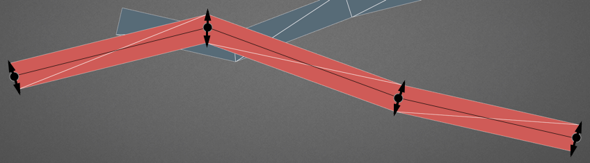

<!--.slide: data-background="./asset/img/graph-gl2.jpg" -->


# ECharts 中运用 WebGL 的实践

沈毅

Note:
这次分享我会讲一下我们团队最近在 WebGL 上的一些实践。

我这次分享主要还是侧重应用 WebGL 时候使用的一些算法，以及一些图形学的知识。
具体的可视化方面的知识也会穿插着介绍。之前对这一块没怎么接触过的同学，我希望这次分享能够让大家觉得 WebGL 和可视化很好玩很有魅力，以后有机会的话也能够玩起来或者在工作中用起来，如果有接触过的，希望能够给大家带来一些不一样的启发。

Ok，言归正传。

---

## 大纲

+ ECharts 简介

+ 为什么选择 Canvas 及 Canvas 的限制

+ WebGL 与 ECharts 的结合

    + 三维空间的可视化

    + 利用 WebGL 加速力引导布局

    + 在前端实现高品质的渲染

Note:

这次分享我首先会花个几分钟大概介绍一下我们现在在维护的开源可视化库 ECharts，包括我们开始会选择使用 Canvas 以及选择 Canvas 后所带来的一些的限制。

然后我们这次的重点是，就像标题说的，着重讲 WebGL 在 echarts 里的应用，包括三部分内容。

第一块是三维空间的可视化，里面碰到的各种坑以及一些经验。
第二块是如何在前端实现高品质的渲染，也就是如何让画出来的三维可视化作品更有逼格，更酷炫。我们可以把它叫可视化的艺术化。
第三块会讲我们如何利用 WebGL 将力引导布局的效率提升了数十倍甚至上百倍，这一块涉及 GPU 的通用计算，希望能够给大家带来一些不一样的新思路。

---

<!--.slide: data-background-video="./asset/video/echarts.mp4" data-background-opacity="0.4" -->

## ECharts 是什么

+ 拥有 <span style="color: #ffbc00">17k star</span> 的开源前端可视化库

+ 声明式的编程接口

+ 丰富的可视化类型和交互方式

+ 大数据量展现的能力

+ 吸引眼球的动画和特效

Note:
那么 ECharts 是什么，首先它是一个基于 Canvas 的开源前端可视化库。目前在 GitHub 上已经拥有 1w7 的 star 数了。

ECharts 提供的是一个声明式的接口，也就是说用户通过一系列配置项去描述如何展示一个图表以及交互组件，这种声明式的接口有利有弊，优点是它没有程序逻辑，上手非常简单，而且不会写程序的，比如我们的设计师，没有任何的程序基础，琢磨琢磨也能画出一个像样的图表。弊端就是它很难被扩展，需要我们提供丰富的配置项去支持用户自定义的展示，其实相当于把很多工作量转移到我们身上了，而且做不了还容易被喷。

然后几个是 ECharts 的主要特性，丰富的可视化类型以及交互组件，大数据量展现的能力，以及吸引眼球的动画和特效，这里就不细讲了。

然后我们这周五也刚发布了 ECharts GL

----

## 为什么选择 Canvas？

+ 更灵活的性能优化

+ 像素操作的能力

+ 能够和 WebGL 更好的结合

Note:

可以说 ECharts 最先打的招牌，或者说很多人对 ECharts 感兴趣就是因为它当时区别于其它的可视化库用 Canvas 去作为底层绘图接口，所以性能很好，能够绘制十几万的大规模散点图。

然后也能进行像素操作，基于像素处理我们可以绘制几十上百万的数据，也可以做图片的处理，或者尾迹特效等等。。

还有与 WebGL 更好的结合，Canvas 可以直接作为纹理给 WebGL 使用。

----

## 越来越复杂的需求

+ 我要三维图表

+ 我要显示几十万的数据

+ 我要一秒内能够完成关系图布局

+ 我要大屏上酷炫的特效


Note:
但是，随着 echarts 的用户越来越多，我们也会收到各种各样更复杂的需求。比如 GitHub 上的月经贴就是问 ECharts 有没有三维的图表，ECharts 最多能够展示多少量级的数据，为什么我才十万的数据就卡卡的了，

我要一秒内能够完成关系图布局这个是上次去浙大 CAD 实验室交流的时候一个同学问我们的一个问题，因为他们之前接手的一个项目有这个需求，然后用了一些取巧的手段去实现了，问 echarts 有没有什么思路实现这种快速的布局，当时想了想并没有什么太好的办法，因为关系图所用的力引导布局就是这么一个复杂度，很难在算法层面去做很大的优化。

最后是用户也会经常提的，我想在大屏产品里用 ECharts，想要各种酷炫，blingbling的特效，就像你们百度做的迁徙图一样。

----

## 越来越力不从心的 Canvas

+ 画路径还是矢量的方式

+ 只能“软渲染”三维图形

Note:
当然，这些需求对于 Canvas 来说肯定是很吃力的

Canvas 画路径本质上还是矢量的方式，就算有 GPU 加速，为了画个圆浏览器的底层图形库还是需要做很多事，将圆转成贝塞尔曲线，细分顶点，三角化(GrAAConvexTessellator)等等。所以往往浏览器一帧画几千个圆就已经比较卡了。

还有因为 Canvas 还是个二维的绘图接口，它只能软渲染三维图形，这种软渲染有个优势是兼容性好，在大部分的移动端也能跑起来，但是稍微复杂点的三维场景他就不行了，第一点就是刚才提到的性能限制，还有这种“软渲染”的方式在三角面片交叉的时候没法正确处理，这在早期的 Flash 三维引擎中也存在这个问题。

----

<iframe data-src="./asset/ec-demo/airline.html" class="fullscreen front" frameborder="0"></iframe>

Note:
这个 6w5 千条飞机航线的可视化例子就非常明显了，Canvas 能够把它画出来，但是想要交互，就非常非常卡。

---


## 新世界的大门 <!-- .element: class="fragment" -->


Note:
既然 Canvas 解决不了，那么我们就尝试使用 WebGL 去解决这个问题。希望 WebGL 嫩巩固帮我们打开这个新世界的大门

----

<!--.slide: data-background-video="./asset/video/baidu-screen.mp4" data-background-opacity="0.2" -->

## WebGL 能够带来什么

+ 三维场景的绘制

+ 二维绘制的性能提升

+ GPU 通用计算(GPGPU)

+ 更加酷炫的效果

Note:

WebGL 能给我们带来什么？这个门后面是什么呢？首先是它的老本行，去绘制三维场景。比如这一页背景视频是我们帮百度世界大会开发的一个大屏，里面的场景都是三维的，包括屏与屏之间的切换都是三维的效果。

然后是二维可视化的性能提升，比较多的就是用 WebGL 在地图上打很多很多点。可能会打上上百万甚至上千万的点去看一个整体分布。

然后是 GPU 的通用计算，这一块可能是大家不太能想到的，因为 GPU 天生的并行性，所以很多开发者会尝试在 GPU 上去做一些通用计算，去加速一些适合并行的算法，比如解矩阵，物理中的布料运算，求 FFT 等等。

最后就是 WebGL 能够给我们给我们带来更多炫酷的效果，这个大家从背景视频的效果里也能看出来。

----

<iframe data-src="./asset/ec-demo/airline-gl.html" class="fullscreen" frameborder="0"></iframe>

Note:
这个示例就是同样的航线数据，通过 WebGL 可视化出来的效果，我们可以已经可以实时的交互，缩放浏览，甚至还能加入飞行轨迹的特效。


---


能力越大

## 坑越大 <!-- .element: class="fragment" -->

Note:
当然，俗话说得好，能力越大，留的坑越大，在 ECharts 集成 WebGL 的过程中，包括平时我自己在做其它的 WebGL 项目的时候，基本上是一路踩着各种各样的坑过来的（花式踩坑）。

----

## WebGL 的使用和坑

+ 三维图表的绘制

+ 利用 WebGL 加速力引导布局

+ 前端实现高品质的渲染


Note:
所以接下来的主体部分我会分为这三块去介绍我们这样一路采坑所积累的一些经验。
分别是三维图表的绘制，前端实现高品质的渲染，然后利用 WebGL 加速力引导布局这个案例来介绍 GPU 通用计算的一些思路。

---


<!--.slide: data-background="./asset/img/bar3D.jpg" data-background-opacity="0.2" -->

# 三维图表

Note:
首先是三维图表的绘制这一块是必不可少的。

----

<div class="fullscreen">
    <iframe data-src="./asset/ec-demo/scatter3D-simple.html" frameborder="0" style="width: 50%;height:50%;float:left;"></iframe>
    <iframe data-src="./asset/ec-demo/line3D-simple.html" frameborder="0" style="width: 50%;height:50%;float:left;"></iframe>
    <iframe data-src="./asset/ec-demo/bar3D-simple.html" frameborder="0" style="width: 50%;height:50%;float:left;"></iframe>
    <iframe data-src="./asset/ec-demo/surface-simple.html" frameborder="0" style="width: 50%;height:50%;float:left;"></iframe>
</div>

Note:
三维图表呢基本上就是二维图表在维度上的一个扩展，像现在这些直角坐标系上的散点图，折线图，柱状图都可以加一个 Z 轴扩展到三维空间。散点图常用来画分布，比如这个散点图画的是一个二维的高斯分布。然后这个柱状图是一个二维的柏林噪声分布

这个柏林噪声比较有意思，是很多程序生成艺术里面都会用到的

还有三维空间上表示趋势的曲面图。这个曲面图也可以用来做机器学习的可视化啊，也可以用来画函数曲面

---

总结起来就是

## 点 · 线 · 面 <!-- .element: class="fragment" -->

Note:
这些三维的可视化，总结起来就是画点线面。

可视化中的点可以表示颜色，形状，三维空间中的位置等属性。
线用于连接点，可以表示起点和终点，比如飞机航线，也可以用于表示数据的走势
面可以通过面积表示数据的大小，三维中面也可以用来表示一个平面上数据的走势。

---

## 画好三维的点线面

Note:

所以这些点线面其实就是组成三维可视化的基本图元。

画好点线面，在三维可视化中也变得非常重要，这些在  Canvas 里非常简单，比如画点用 fillRect，画线用 stroke，画面用 fill 就可以了。

但是 WebGL 设计的初衷其实不是用来画这些东西，所以这些看起来非常简单的图形要画好还是挺不容易的。

---

<!--.slide: data-background="./asset/img/scatter3d.jpg" data-background-opacity="0.3"  -->

## 点

+ 三维空间的位置

+ 颜色

+ 形状

+ 大小

Note:
首先是点。

刚才说了一个点拥有颜色，形状，三维空间中的位置等属性。所以我们在画点的时候要留意是否能够准确的表达出这些属性。

----

#### JavaScript
```javascript
gl.drawArrays(gl.POINTS, 0, 100);
```

#### Vertex
```glsl
attribute float size;

gl_PointSize = size;
```

#### Fragment
```glsl
gl_FragColor = vec4(1.0);
```

Note:
WebGL 有画点的原生接口，我们只需要在 drawArrays，就是 WebGL 最后调用的绘制命令，声明模式为画点的模式，然后 WebGL 就会将单个顶点输出为像素点，而且还可以设置 gl_PointSize 设置这个方块点的大小。

这种方式非常快，因为它需要的顶点数量很少，画一个数据只需要一个点，也不需要构建三角面，代码也简单，往往瓶颈在显卡的像素填充率上。

而且这种画点的方式还有一个好处，它是屏幕空间大小的，就是不管怎么投影变换都是这个 5 个像素的大小，这样有什么好处呢，刚才提到点可以通过大小去表示数据，那如果不是屏幕空间的恒定大小的，而是有透视近大远小的话，就没法准确的去通过大小去表达数据了

----

## 不同形状的点

+ 把形状用白色填充到 Canvas 上作为纹理


```glsl
gl_FragColor = color * texture2D(sprite, gl_PointCoord);
```

Note:
使用 gl_PointSize 扩展后的点都是方块，如果我们需要自定义的形状，例如常见的圆形，三角形，就需要 Canvas 来帮忙了，我们可以预先把这个形状用白色绘制在一个 Canvas 上，然后用这个 Canvas 作为点的纹理，就是贴到这个方块上面，画出来就是这个形状了。

而且 WebGL（OpenGL）非常贴心的提供了一个 gl_PointCoord 的内置变量，去获取点上每一个像素的纹理坐标。

这个非常简单，画出来的效果也不错。

----

<iframe data-src="asset/ec-demo/scatter3D-simplex.html" class="fullscreen" frameborder="0"></iframe>

Note:
基本上这样就能画出刚才背景图那个散点图了。

这是三维的柏林噪声。

----

## 描边？

+ 画轮廓线

+ 单独再创建一张描边的纹理

+ 单纹理中描边和填充用颜色区分

+ Signed Distance Field <!-- .element: class="fragment highlight-blue" -->

Note:
但是呢它刚才解决的只是填充的问题，还有个问题就是如何描边，描边可以让混在一起的颜色相近的图形更清晰的被区分开来。

有几种手段：

1. 画轮廓线，就是一个顶点一个顶点去构建轮廓线，这个的开销太大，所以直接可以 pass 了。
2. 单独创建一张描边的纹理。
3. 在创建纹理的时候也提供描边，但是用不同颜色区分。然后 shder 里用颜色去判断是填充还是描边。
4. 使用 Signed Distance Field，我们最后选择了这个方案，因为它有几个前面方案无法比拟的优势，后面会讲到。

----

<!--.slide: data-background-iframe="./asset/ec-demo/sdf-heatmap.html" -->

## Signed Distance Field（SDF）

+ 存储到最近的图像边缘的距离

+ Shader 中根据这个距离填色

```glsl
float d = texture2D(sprite, gl_PointCoord).r;
// Antialias
gl_FragColor.a *= smoothstep(0.5 - smoothing, 0.5 + smoothing, d);
```

Note:

Signed Distance Field 它用来表示到曲线和曲面的距离场，方便 shader 里根据这个距离场构建曲面或者曲线，valve 早些年发表了一篇论文用它来绘制矢量文字，然后效果非常好，大家都在用，相比普通的纹理贴图或者 alpha test，它的存储空间很小，而且放大后依然很清晰，

我们要做的就是借鉴它绘制文字的方案去绘制矢量图形，

先把一个图形画到 Canvas 上，然后根据这张 Canvas 的图生成一个 SDF，SDF 中存储的都是每一个像素到图像边缘的距离，这个背景就是我用热力图把它可视化出来了。可以看到角落上的离边缘比较距离比较远所以值比较大，边缘上的就是 0，图形里的是负值，正负用来区分是图形内还是图形外，这也是 SDF 里 singed 的意思。

----

<iframe data-src="asset/ec-demo/sdf-compare.html" class="fullscreen" frameborder="0"></iframe>

Note:

上面这一层就是我们生成的距离场图了，32x32 的大小，中间是根据距离场在 shader 中绘制出来的结果，可以看到就算放大了几倍也很清晰，最下面这排作为对比就是把一张同样大小的纹理贴图直接放大的结果。

TODO:
外发光

----

## 优势

+ 存储空间小，放大后也有清晰的边缘

+ 开销小

+ 能实现外发光，投影

Note:
可以看到 SDF 的一些比较显著的优势。

然后尽管它需要在 shader 里动态计算一下，但是这个计算是一个非常简单的根据距离插值的操作，所以相对于很多矢量绘制的方式，它的开销很小。


---

<!--.slide: data-background="./asset/img/alirline.jpg" -->
## 线

+ 折线

+ 飞线

+ 轮廓线

+ 网格线

Note:
echarts-gl 里有很多需要画线的地方，除了三维的折线图，飞线图等，笛卡尔坐标系，各种轮廓，网格也需要画线。所以我们需要一个实现高质量的，各种场景下稳定展现的线的绘制方案。

----

## 原生态画线

```js
gl.lineWidth(5);
gl.drawArrays(gl.LINES, 0, 100);
```

+ gl.LINES

+ gl.LINE_STRIP

+ gl.LINE_LOOP

Note:
跟刚才画点一样，WebGL 本身也支持画线的模式，能够设置线宽，而且还支持多中画线的配置。看起来非常方便。实际上老版本的 echarts-x 就是这么画飞线的。

----

## 但是

----

## 原生画线方法的各种坑

+ 不同的显卡驱动下画线的效果会有细微区别

+ 无法控制 lineJoin 和 lineCap

+ 有最大线宽的限制，而且 Windows 下最大只有 1 <!-- .element: class="fragment highlight-blue" -->

Note:

实际上 WebGl 画线并没有 lineJoin 和 lineCap 的效果

然后，还有一个最大的问题，就是 windows 下最粗的线宽只有 1，这个之前就有用户跟我们反馈说 echarts-x 怎么没法设线宽，我当时用的 mac 还没留意到是 windows 的问题，后来在 windows 上一试才发现真的有这个问题。

因为 windows 下 chrome 底层实际上是转成 DirectX 的接口了，而 DirectX 并不支持设置线宽，所以会有这个问题。

但是网格线什么的肯定要设置线宽，所以有这个 bug 肯定是不行的。


----

## 三角化线段



Note:
虽然说抛弃自带的画线接口很可惜，但是线宽的限制这个问题实在是太严重了，所以没办法，我们只能重新实现一遍线段的绘制。

做法就是如图用两个三角面组成一个线段。

----

## 实现屏幕空间固定宽度

```glsl
vec2 dirA = normalize(currScreen - prevScreen);
vec2 dirB = normalize(nextScreen - currScreen);
vec2 tanget = normalize(dirA + dirB);

len *= 1.0 / max(dot(tanget, dirA), 0.5);
offset = tanget;

offset = vec2(-offset.y, offset.x) * len;
currScreen += offset;
```

Note:
要注意的是，如果是在传入 GPU 之前，也就是在 JS 中就把顶点构建好，它的宽度还是三维空间的，没法实现屏幕空间宽度。

也就是没办法保证视角放大缩小后线宽是一致的。除非每次视角变换都重新构建一次顶点，对于只有几百个数据的图可能还好，但是对于有几千个数据，上百万个顶点的图，明显就不现实了。

所以我们需要考虑顶点着色器中去实现这个宽度的计算和顶点的变换。

顶点着色器中取当前点前后顶点，先变换到屏幕坐标，然后计算出法线，切线等后，再移动顶点屏幕空间的宽度。因为原先顶点着色器就需要做把模型坐标系的顶点位置变换到投影后的屏幕空间，所以这一步只是在变换中多加了几次计算，开销是完全可以接受的。

----

<iframe data-src="asset/ec-demo/line3D-wireframe.html" style="width:100%;height:500px;" frameborder="0"></iframe>

Note:
这是屏幕空间固定宽度的线的例子，我们放大之后，看起来像是被拉长了，实际上并不是拉长了，就是因为不管怎么缩放都是不变的宽度。

---


## 面

+ 三角面

+ 程序生成

Note:
刚演示了单个的顶点，两个顶点组成的线段，而三个顶点组成的三角面是 WebGL  里面绘制的基础，它也是游戏中几乎所有的三维场景绘制的基础。

在游戏中三角面都是通过建模工具生成的，而在 echarts-gl 等三维的可视化库中，三角面片都需要根据输入的数据程序生成。刚才在画线部分已经涉猎了如何用三角面去画线。

程序生成有一个好处，就是它不用加载模型资源，因为 Web 端往往网速会成为影响用户体验的一大因素，如果要很高质量的模型，就需要加载很大的模型，但是可能很多人等不及加载完就把网页关了，如果程序生成就可以控制模型的精度而不用担心加载时间。

----

<!--.slide: data-background="./asset/img/temple.jpg" -->


----

## Geo3D

+ 将 GeoJSON 转成 Mesh

+ Triangulation

+ Extrude

Note:
还有一个构建面的例子是三维的地图，一般地图的轮廓都是用 GeoJSON 格式存储的，GeoJson 是常见的用来表示地理数据的格式，Mesh 呢就是一堆三角面组成的网格，然后一般来说 GeoJson 里都是多边形 Polygon，我们要做的就是通过 Triangulation，三角化算法把这个 Polygon 转成三角面，然后再 Extrude 挤压得到一个有厚度的模型。

----

<!--.slide: data-background="./asset/img/map3D-wireframe.jpg" -->

----

## Triangulation - Ear Clipping

+ 实现简单

+ 可以利用空间哈希优化

+ 使用链表存储顶点


Note:

三角化我们用了 Ear Clipping 这个算法，这个算法不论从名字还是实现都非常直白，就是裁耳朵，就像这个示意图里演示的，我们从一个多边形李找出一个这样的一个三个顶点作为一个耳朵，然后把它裁掉作为一个三角面。然后这样依次裁处所有的三角面来。

这个算法看起来像是 On 的开销，实际上它是 On2 的，这个 n2 就花在了判断三个顶点是否是一个耳朵上了。我们需要挨个判断每个点是否在这个三角面上，才能确定它是可以被裁掉的。

但是可以利用 zorder 等空间哈希来进行优化。比如划分区域，只需要找出这个三角面所在的这个区域的顶点去判断就行了，这个空间哈希能够带来的性能提升还是非常可观的，基本上大部分场景都能够 hold 住。

还有一个优化的技巧是你的数据结构要选对，因为它会频繁的增删顶点，所以用 JS 的自带的数组会比较慢，我们后来改用了链表来存储顶点。

---

<!--.slide: data-background-video="./asset/video/gpgpu.mp4" data-background-opacity="0.4" -->

# GPU 的通用计算

WebGL 中实现力引导布局

Note:
这次分享的最后一块，是通过在 WebGL 中实现力引导布局这个案例来介绍如何去做 GPU 的通用计算。

----

## 力引导布局介绍

+ 用于关系图的布局

+ 节点与节点之间模拟斥力，边模拟弹簧的引力

+ 每次迭代 O(n2), 需要上百次迭代才能结束

Note:
首先介绍一下什么是力引导布局。

力引导布局是用于关系图布局的经典算法， 有很多种算法和实现，但是其基本原理都是一样的，都是节点与节点存在一个电荷的斥力，边则存在一个弹簧的引力。每次迭代通过计算每个节点的受力，并且根据受力产生一个位移，在多次迭代后整个布局的能量会趋向一个平衡，关系边多的节点间有一个聚类的趋势。

所以传统的力引导算法开销很大，因为要有上百次，每次都是 O(n2) 受力计算才能结束。为了防止布局的阻塞给用户带来的困扰，我们多会把布局过程表现出来，刚好这个动画也挺有意思的。

这个是 echarts 的力引导布局。

----

<iframe data-src="asset/ec-demo/webkit-dep.html" class="fullscreen" frameborder="0"></iframe>

Note:
这个数据大概 500 个顶点，800 条边


----

<iframe data-src="asset/ec-demo/eurosis.html" class="fullscreen" frameborder="0"></iframe>

Note:
接下来来看一个更大规模的例子，
这份数据 1285 个顶点，7586 条边

可以看到已经很卡了。

----

## 力引导布局的性能优化

+ Barnes Hut Simulation

+ 多线程？Web Worker

+ SIMD？

Note:
在算法层面力导向布局最常见的性能优化方式就是这个 Barnes Hut Simulation，它把所有节点放到一个四叉树里，然后对于一批距离远的节点可以看做一个整体计算斥力。而不用去一个点一个点的算。

在程序层面，可以通过 SIMD，多线程等方式去并行计算，也可以带来可观的优化效果。

但是 JS 并不支持多线程，现在浏览器有 WebWorker，我们可以把布局的方法在一个单独的 WebWorker 里去做，这样有一个好处是布局的代码不会阻塞到重绘的代码，交互会更顺畅。

力引导布局里有很多向量操作，所以 SIMD 也能带来显著的优化效果，但是遗憾的是只有 firefox nightly 现在才支持 SIMD。

----

<iframe data-src="asset/ec-demo/eurosis-gl.html" class="fullscreen" frameborder="0"></iframe>

Note:
刚才说到在 WebWorker 中做布局可以保证渲染的线程跟布局的线程分离，如果是单线程的话我们可能就是布局一次，渲染一次，如果布局多次就可能会阻塞渲染，导致交互不顺畅，但是用 WebWorker 我们就没这个担忧，我们可以再 Worker 中布局迭代多次后再提交给主线程渲染。这样可以有效的提高布局的速度

----

<iframe data-src="asset/ec-demo/eurosis-gl.html?5" class="fullscreen" frameborder="0"></iframe>

----

<iframe data-src="asset/ec-demo/eurosis-gl.html?10" class="fullscreen" frameborder="0"></iframe>

Note:

----

## WebGL 中实现力引导布局


Note:
一般 WebGL 实现 GPGPU 的思路就是把各式各样的数据存到纹理里，然后在 shader 里取出数据之后进过一系列计算之后再写入纹理。

----

<iframe data-src="asset/ec-demo/eurosis-gl-gpu.html" class="fullscreen" frameborder="0"></iframe>

Note:

----

<iframe data-src="asset/ec-demo/graph.html" class="fullscreen" frameborder="0"></iframe>


----

<!--.slide: data-background="./asset/img/graph-gl.jpg" -->

## 性能对比

Nodes: <span style="color: #ffbc00">22k</span>

Edges: <span style="color: #ffbc00">48k</span>

----

## 原论文

CPU without Barnes Hut: <span style="color: #ffbc00"><b>~41000 ms</b></span>

CPU with Barnes Hut: <span style="color: #ffbc00"><b>~400 ms</b></span>

Note:
这是这个力引导算法原论文给出的数字

----

<p style="font-size: 2rem;color:#ffbc00;">Macbook 13 2012</p>

CPU without Barnes Hut: <span style="color: #ffbc00"><b>~28000 ms</b></span>

CPU with Barnes Hut: <span style="color: #ffbc00"><b>~1000ms</b></span>

<p class="fragment">
    GPU: <span style="color: #ffbc00"><b>~260ms</b></span>
</p>

Note:

我先在自己的电脑上测试了一下不同算法的性能

没有 Barnes Hut 优化的一次迭代需要近 28s，加上 Barnes Hut 也需要近 1s，然后 GPU 运算的 260ms，有几倍的提升，但是这个提升不是太明显

我在想可能是 HD 4000 这张显卡太烂了，于是又在台式机上试了下。

----

<p style="font-size: 2rem;color:#ffbc00;">GTX1070, i7</p>

CPU without Barnes Hut: <span style="color: #ffbc00"><b>~12000 ms</b></span>

CPU with Barnes Hut: <span style="color: #ffbc00"><b>~300ms</b></span>

<p class="fragment">
GPU: <span style="color: #ffbc00"><b>~2ms</b></span>
</p>

Note:

----

<!--.slide: data-background="./asset/img/gtx1080.jpg" -->

## GPU 加速在高端显卡中的性能提升十分显著

Note:
这里顺便给核长最新款的战术核显卡打了个广告。

----

## 限制

+ 需要浏览器支持 WebGL

+ 需要浮点纹理扩展

+ 数据量特别大的时候容易造成整个系统阻塞


---

<!--.slide: data-background="./asset/img/buildings.jpg" -->

# 高品质的渲染

Note:
如何在前端实现高品质的渲染效果

这个背景图就是用ECharts渲染出来的一个建筑群的效果。

----

## 不要过时的三维效果


Note:
很多人排斥三维的可视化还有一个原因是因为很多三维的可视化效果渲染效果十分廉价，比如这张柱状图，这张地球，和这张饼图。充斥着经典的 phong 光照模型的高光和其所带来的塑料感，以及粗糙的贴图等等。

----

目标

## 随手截一张就是桌面背景 <!-- .element: class="fragment" -->

PPT，媒体写作 <!-- .element: class="fragment" -->

Note:

我们自己觉得画质需要达到的一个目标就是

为什么要设这个目标，因为之前我们发现很多用户用 echarts 的方式就是在我们的示例页面改改数据后直接截图就用了，比如说放到自己的 PPT 里，文章里等等。

所以我们觉得 echarts-gl 除了需要能够实时交互，展示图表外，也需要有一定的能力能够通过改改配置，右边就能生成一张非常漂亮的图片。

然后这张图片他能够用来做 PPT 或者媒体写作的背景。

----

<!--.slide: data-background="./asset/img/simon5.jpg" -->

Note:
这个是PPT领域非常有名的大 V 阿文在我们的 echarts-gl 发布后第一时间尝鲜做的几个作品，我当时看到后觉得非常惊艳

----

<!--.slide: data-background="./asset/img/simon2.jpg" -->

----

<!--.slide: data-background="./asset/img/simon7.jpg" -->

----

<!--.slide: data-background="./asset/img/simon8.jpg" -->

----

# 几个对画质提升比较大的技术

Note:
我这次 PPT 里的图片就都是用 echarts-gl 渲染的。

----

## 基于物理的渲染（PBR）


Note:
基于物理的渲染现在在游戏里用的比较多，可以说是最近这几年一个比较突破性的渲染上的提升了。大家如果玩游戏的话可能经常会听到各种 3A 游戏里宣传自己是基于物理的渲染效果的，甚至可能在手游里也会有看到。

大家可以看这两张图片的红框部分，右边 PBR 的光照更加丰富柔和，而左边的光照就很单一生硬。

----

+ HDR 的环境光照贴图

+ 对环境光照的积分预计算（prefilter）<!-- .element: class="fragment highlight-current-blue" -->

+ 能量守恒的光照公式

+ <s>经验模型</s> 直观的公式参数。


Note:
一般基于物理的渲染要做到这么几点，首先它需要一张 HDR 格式的环境光照贴图。

然后因为光照计算需要做积分计算这张环境贴图里每一个像素产生光照贡献，如果是实时做的话就会性能很差，所以一般会对这张环境光照的贴图做积分的预计算。得到右边这张看起来像是被模糊了的图。这种预计算的卷积可能不是完全正确的结果，但是足够以假乱真了。实际上实时渲染基本上就是在用各种 trick 去实现以假乱真的效果。

Ok，然后最后我们再使用一个能量守恒的光照公式应用到像素上。

----

## 软阴影


Note:
在图中这样建筑可视化的示例中，阴影是用来增强空间感的一个非常重要的手段，如果没有阴影，我们可能会觉得这些建筑就是一片连起来的，建筑也是浮在地面上的感觉。
那么软阴影又是什么，这个软的意思就是阴影的边缘要柔和，不能太硬，这个基本上需要靠很多采样才能解决。

----

## SSAO - 环境光遮蔽


Note:

光有阴影还不够。

因为阴影只能提供单一的单光源的投影，一个点受到的光照也只能二元化的判断有阴影和无阴影，但是现实中显然没这么简单，显示中可能一些角落的区域受到的光少导致非常暗。这个我们叫环境光遮蔽

环境光遮蔽是计算一个点上面能够受到多少环境光，被其它物体包围得越多的地方就会越暗。它作为阴影的补充可以让整个画面更有层次感，不会让阴影显得很单调。
一般游戏里都采用能够实时运算的屏幕空间环境光遮蔽。

----

<h2 style="text-shadow: 0 0 10px #000">景深</h2>

<!--.slide: data-background="./asset/img/buildings-dof.jpg" -->

Note:
景深是平时摄影的时候非常常见的一个效果，一般摄影时在镜头的聚焦区域图像会比较清楚锐利，有德味。而聚焦区域外的区域则会变得很模糊，这段聚焦的区域我们叫景深。

我们在画面中加上景深也可以让镜头效果显得更真实，像这个 GeoJSON 的例子可以有一种微型模型的感觉。

不过这个景深用的时候也得小心，我之前给一个朋友看一个类似这样的有景深的例子，他以为模糊的部分是还没加载出来。

----

<!--.slide: data-background="./asset/img/bokeh.jpg" -->

<h2 style="text-shadow: 0 0 10px #000">散景 Bokeh</h2>

Note:
一般相机拍出来的景深还有一个很重要的效果就是这个散景效果，就是背后这些特别亮的地方会有光斑的形状，但是现在实时的渲染里要实现这样的散景效果开销都比较大。需要在这个 disk 里采很多样。


----

## 调色

ACES Tone Mapping + Color Grading


Note:
当然跟摄影一样，你可能会对图片出来的整个色调不满意，所以一般再会有一个颜色纠正的操作，

----

## 在有限的电脑配置内实现“无限”的画质


采样！采样！采样！ <!-- .element: class="fragment" -->

Note:

我们刚才说的这些效果，软阴影，屏幕空间的环境光遮蔽，景深，都需要对周围的纹理进行采样，而且采样需要越多效果越好。因为这些本质上都是蒙特卡洛方法，就是采样越多越趋近于最优值

实际上许多机器，比如我现在这台小破本，如果把这些特效都设得很高，也就是采样很多，基本上是不能流畅运行的，但是如果采样少了效果就不好。

----

## 渐进式增强

+ 将采样分布到多帧中

+ 交互的时候能够立刻反馈

+ 停止交互后渐进增强画面

Note:

那怎么办？

一帧解决不了的，我们就分很多帧去解决

----

## 抗锯齿

+ MSAA（不支持离线的 FrameBuffer）

+ SSAA（慢）

+ FXAA（效果差强人意）

+ **Temporal AA**

Note:
高品质的渲染还有一个很重要的因素是抗锯齿。锯齿，俗称狗牙，也是一个要产出高品质的画面的比较大的杀手。

锯齿本质上也是因为单个像素对场景的采样不足造成的。

然后 FXAA 是之前用的很多的一个屏幕空间的抗锯齿算法，据说非常trick，trick 到原作者都不知道 why it works

----


----

<iframe width="1200px" height="720px" data-src="asset/ec-demo/buildings.html" frameborder="0"></iframe>

----

## Temporal Methods 无法解决的

+ 动态的画面

+ 几何信息缺失

+ 精度不够 - Bias

Note:

尽管说通过 Temporal Methods 我们能够一直采样最后收敛到一个最优的结果，但是它并没有办法解决一些信息丢失的问题，比如刚才介绍的 SSAO 因为是屏幕空间的，很多隐藏在后面的几何体其实也会对像素点有遮蔽，但是因为无法获取到这个几何体的信息就没办法判断到。

还有就是因为像 ShadowMap 这样数据精度不够需要添加 bias 的算法，Temporal Methods 也没办法解决。

所以开始对无限的画质中无限这个词加了引号。

---

## 总结

+ 三维图表的绘制

    + 点线面

+ GPU 通用计算

+ 优化画质的方法

    + Temporal Methods

---

<!--.slide: data-background="./asset/img/buildings2.jpg" -->

## Thanks


---
